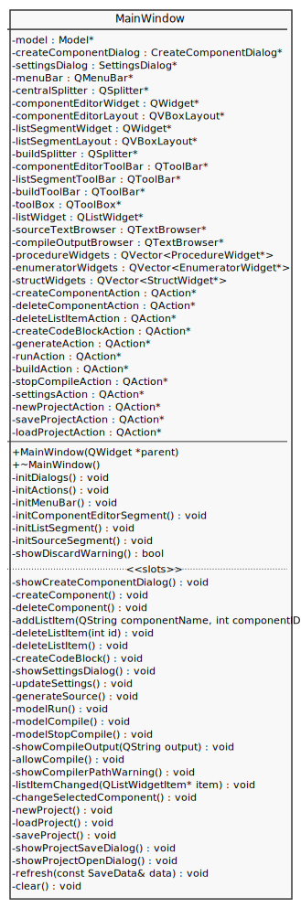
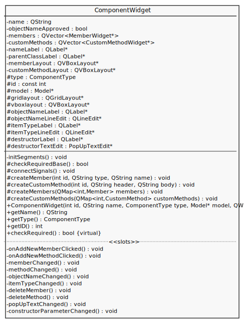
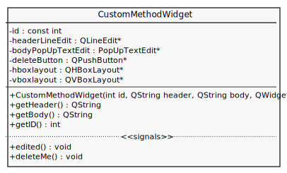
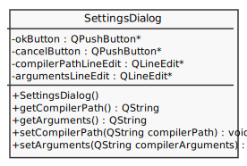
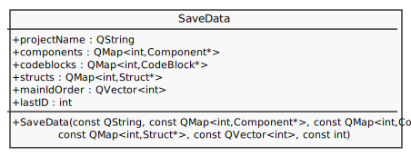
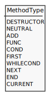

> Borító

# Témabejelentő

Egy olyan kódszerkesztő, amely támogatja az osztály-sablon könyvtár biztosította eszközök egyszerű létrehozását vizuális formában. Hozzájárul a kód újra felhasználásának gyakorlásához és az objektumorientált programok öröklődéseinek megértéséhez. Emellett fejleszti a programtervezési készségeket a programozási tételek mentén. Az átlagos kóddal szemben sokkal érthetőbb formában jeleníti meg egy program összetételét.

Az osztályok egy-egy építőelemként jelennek meg és felületet biztosítanak részegységek hozzáadására. Lehetőséget ad a könyvtár által meghatározott objektumok létrehozására, felülírandó metódusok definiálására, majd ezek építőelemként történő felhasználására. Az így összeállított saját osztályokra ezután az alkalmazás hagyományos kódszerkesztő részében lehet hivatkozni, így létrehozva a teljes programot, melyből ezután egy C++ forráskód generálódik.

Az alkalmazás Qt Creator segítségével lesz megvalósítva C++ nyelven. Azért erre esett a választás, mert minden szükséges eszközt biztosít az applikáció igényeihez és a hatékony fejlesztéshez. Ha esetleg a későbbiekben több platformon is elérhetővé szeretnénk tenni az alkalmazást, akkor ebben a környezetben ez egyszerűen megoldható és mindenhol ugyanolyan formában jelenik majd meg. 

# Tartalomjegyzék
0. [Köszönetnyilvánítás](#köszönetnyilvánítás)
1. [Bevezetés](#bevezetés)
2. [Felhasználói dokumentáció](#felhasználói-dokumentáció)
    1. [Applikáció bemutatása](#applikáció-bemutatása)
    2. [Telepítés és rendszerkövetelmények](#telepítés-és-rendszerkövetelmények)
    3. [Használat](#használat)
        1. [Kezdőlap](#kezdőlap)
			1. [Component Editor](#component-editor)
			2. [Main List Editor](#main-list-editor)
			3. [Forráskód nézegető és fordítás, futtatás](#forráskód-nézegető-és-fordítás-futtatás)
3. [Fejlesztői dokumentáció](#fejlesztői-dokumentáció)
    1. [Fejlesztői környezet](#fejlesztői-környezet)
    2. [Drótváztervek](#drótváztervek)
	3. [Használati esetek](#használati-esetek)
    4. [Architektúra](#architektúra)
    5. [Nézet](#nézet)
		1. [MainWindow](#mainwindow)
		2. [ComponentWidget, ProcedureWidget, EnumeratorWidget](#componentwidget-procedurewidget-enumeratorwidget)
		3. [StructWidget](#structwidget)
		4. [MemberWidget és CustomMethodWidget](#memberwidget-és-custommethodwidget)
		5. [PopUpTextEdit és TextInputDialog](#popuptextedit-és-textinputdialog)
    6. [Modell](#modell)
		1. [Modell adattagok és metódusok](#modell-adattagok-és-metódusok)
			1. [Adattagok](#adattagok)
			2. [Projektkezelés](#projektkezelés)
			3. [Létrehozó függvények](#létrehozó-függvények)
			4. [Törlő függvények](#törlő-függvények)
			5. [Setterek](#setterek)
			6. [Getterek](#getterek)
			7. [Egyéb függvények](#egyéb-függvények)
			8. [Forráskód generálás](#forráskód-generálás)
			9. [Fordítás és futtatás](#fordítás-és-futtatás)
		3. [Modell által használt osztályok](#modell-által-használt-osztályok)
			1. [Component](#component)
			2. [SaveData](#savedata)
			3. [Egyéb segédobjektumok](#egyéb-segédobjektumok)
    7. [Perzisztencia](#perzisztencia)
	8. [Signal-ok és Slot-ok](#signal-ok-és-slot-ok)
	9. [Resources](#resources)
	10. [Tesztelés](#tesztelés)
		1. [Kézi tesztek](#kézi-tesztek)
		2. [Automatikus tesztek](#automatikus-tesztek)
4. [Összefoglalás](#összefoglalás)
5. [További fejlesztési lehetőségek](#további-fejlesztési-lehetőségek)
    1. [Component Editor](#component-editor)
    2. [Fordító](#fordító)
    3. [Main Editor](#main-editor)
    4. [Hivatkozások](#hivatkozások)
    5. [Kódszerkesztő](#kódszerkesztő)
    6. [Syntax Higlighting](#syntax-higlighting)
    7. [Cross-platform](#cross-platform)
    8. [Nyelv](#nyelv)
    9. [Megjelenés](#megjelenés)
6. [Forrásjegyzék](#forrásjegyzék)

# Köszönetnyilvánítás

Ezúton szeretném megköszönni mindazoknak, akik nélkül ez a dolgozat nem jöhetett volna létre:

Köszönet a konzulensemnek, aki rendelkezésemre bocsátotta tudását, hasznos tanácsokkal és rengeteg segítséggel láttott el a dolgozat elkészítése során.

Köszönet az Eötvös Loránd Tudományegyetem Informatikai Karának, hogy az itt eltöltött félévek alatt elsajátíthattam a szükséges alapokat.

Köszönet a családomnak és barátaimnak, hogy minden támogatást megadtak, amire a tanulmányaim során szükségem volt.

# Bevezetés

Programozás során elengedhetetlen alapokat nyújt a programozási tételek használata, megfelelő alkalmazása. Ezért nem is meglepő, hogy az egyetemen is már az első félévben találkoznak ezzel a hallgatók.

E tudás elsajátításának megkönnyítése érdekében hozta létre dr. Gregorics Tibor Tanár Úr a programozási tételekhez osztálysablonokat megvalósító c++ könyvtárat, amely ezáltal hozzájárul mind a kód újra felhasználásának gyakorlásához, mind az objektumorientált programok öröklődéseinek megértéséhez, de a legfontosabb, hogy fejleszti a programtervezési készségeket a programozási tételek mentén.

A második félévben találkoztam az osztálysablon könyvtárral az Objektumelvű Programozás tárgy keretein belül. Eleinte nem volt a kedvencem, de a félév végére rájöttem, hogy mekkora jelentősége is van igazából.

Mikor eljött az idő a szakdolgozati témaválasztásnak, sokat gondolkoztam, hogy mi is legyen a téma, végül Várkonyi Teréz Anna tanárnő weboldalán futottam össze egy kiírt témával, amely felkeltette az érdeklődésemet és így jöhetett létre jelen dolgozat.

Az alap terv az volt, hogy a könyvtár használatát mégtovább egyszerűsítsük és befogadhatóbbá tegyük azok számára, akik részben még csak ismerkednek a programozással. A felület tehát előre összeállított, minden fontos elemet tartalmazó komponenseket biztosít az átláthatóság kedvéért.

## Osztály-sablon könyvtár

Az osztály-sablon könyvtár a visszavezetéssel tervezett programok C++-beli megvalósítását támogatja. Ahhoz a programozási módszerhez illeszkedik, amely programozási tételekre vezeti vissza a megoldandó feladatot, és a megoldó programkódhoz a könyvtár elemeinek újrahasznosításával jut el. Ehhez egyrészt objektum-orientált technikákra (objektum összetétel, származtatás, virtuális metódusok felüldefiniálása), másrészt osztály-sablonok példányosítására van szükség. A könyvtárban alapvetően kétféle osztályt találunk. Egyfelől a különféle programozási tételeket általánosan leíró osztály-sablonokat, másfelől a nevezetes felsorolásokat definiáló osztály-sablonokat.

Egy tipikus felhasználása a könyvtárnak a következő:
1. Egy konkrét feladat megoldásához származtatunk egy osztályt a feladat megoldására alkalmas programozási tétel osztály-sablonjából,
	1. megadva ezen osztály-sablon sablon-paramétereit (köztük a megoldáshoz felsorolandó elemek típusát: Item ),
	2. felüldefiniálva az osztály-sablon bizonyos virtuális metódusait.
2. Példányosítjuk a fenti osztályt, és ezzel létrehozunk egy tevékenység objektumot.
3. Példányosítunk egy alkalmas felsoroló objektumot. Ennek osztályát vagy közvetlenül a könyvtárból vesszük, vagy magunk implementáljuk a könyvtár Enumerator interfészét megvalósítva a first() , next() , current() , end() metódusokat. Ügyelni kell arra, hogy a felsorolt elemek típusa egyezzen meg a programozási tétel által feldolgozott elemek típusával. (Ez az Item sablon-paraméter helyébe írt típus).
4. Hozzákapcsoljuk a tevékenység objektumhoz ( addEnumerator() ) a felsoroló objektumot.
5. A tevékenység objektumnak meghívjuk a run() metódusát, majd különféle getter-ekkel lekérdezzük a tevékenység eredményét.

### Szerkezete


# Felhasználói dokumentáció

## Applikáció bemutatása

Programozás során elengedhetetlen alapokat nyújt a programozási tételek használata, megfelelő alkalmazása. E tudás elsajátításának megkönnyítése érdekében hozta létre dr. Gregorics Tibor Tanár Úr a programozási tételekhez osztálysablonokat megvalósító c++ könyvtárat, amely ezáltal hozzájárul mind a kód újrafelhasználásának gyakorlásához, mind az objektumorientált programok öröklődéseinek megértéséhez, de a legfontosabb, hogy fejleszti a programtervezési készségeket a programozási tételek mentén.

Az applikáció a könyvtár használatát még tovább egyszerűsíti és befogadhatóbbá teszi azok számára, akik részben még csak ismerkednek a programozással. A felület tehát előre összeállított, minden fontos elemet tartalmazó komponenseket biztosít az átláthatóság kedvéért.

A felhasználónak lehetősége van kedve szerint létrehozni osztályokat a programozási tétel és enumerátor sablonokból leszármaztatva. A létrehozott osztályokat lehet ezután tovább bővíteni, részegységeiket definiálni. Az osztályok részegységei a következők lehetnek: felülírandó metódusok, saját privát adattagok, saját publikus metódusok. A programozási tételeket megvalósító osztályok esetében az általuk használt, szintén létrehozott enumerátort is szükséges megadni. Ezeken kívül lehetőség van saját struktúrák definiálására is, melyek saját publikus adattagokat és metódusokat tartalmazhatnak.

Az általunk létrehozott osztályok közül a "main függvényben felhasználandónak" jelölt programozási tételeket megvalósító osztályok megjelennek az ezt reprezentáló listában, amely a program futásának manipulálására hivatott. Itt lehet meghatározni, hogy milyen sorrendben fussanak le a tételeink, emellett plusz kódrészleteket is tudunk hozzáadni, amely lehetőséget biztosít egyéb kiíratásokra, beolvasásokra, ellenőrzésekre.

A megadott adatok alapján a program generál egy c++ forráskódot, amelyet akár fel is használhatunk saját környezetben, azonban az applikációban rendelkezésre áll a forráskód lefordításának és futtatásának lehetősége. Ehhez a beállításokban szükséges bekonfigurálni a g++ fordító adatait. Az alkalmazás megjeleníti a fordítás és futtatás kimenetét is.

## Telepítés és rendszerkövetelmények

A LibViz tesztelése elsősorban Windows 10-en zajlott, így ez az elsődlegesen támogatott operációs rendszer.

Az alkalmazás egy Windows 10-en futtatható verziója tömörített formában is mellékelve van. Kicsomagoljuk az állományt, amely ezután LibViz mappában található `LibViz.exe` fájl indításával futtatható.

Ha a felhasználó a forráskód alapján szeretné futtatni a programot lokális környezetben, akkor erre is van lehetőség.
A buildelés a Qt Creator segítségével a legegyszerűbb. Ezen belül a Qt 6.0-ás verziója ajánlott, mivel ebben íródott a program.

0.  *előzetes rendszerfüggő compiler, kit beállítások*
1.	projekt betöltése a Qt Creator-be
2.	futtatás

A program már használható is.
Az ilyen módon történő telepítéssel kapcsolatban további információkat lehet találni a Qt Creator dokumentációjában.

|  Minimum rendszerkövetelmény |   |
|--------------------:|:-----------|
| Operációs rendszer: | Windows 10 |
|         Processzor: | 1 GHz      |
|            Memória: | 1 GB       |
|            Kijelző: | 800 x 600  |


## Használat

### Kezdőlap

Az alkalmazás indulásakor egyből egy üres projektben találjuk magunkat, amiben kezdődhet is a munka.


A fő ablak három fontosabb szekcióra bontható, melyek a következők:
- A `Component Editor` a saját osztályoknak biztosított hely. Itt hozhatunk létre új elemeket, valamint módosíthatjuk a meglévőket. 
- A `Main List` a komponensek listáját tartalmazza. Itt állíthatjuk be, hogy a létrehozott komponensek milyen sorrendben fussanak a programunkban, valamint hozzáadhatunk további kódrészleteket is.
- A jobb oldalon található szövegmezők és gombok a generált forráskód böngészését, a programunk fordítását és futtatását, és iméntiek kimenetének megtekintését teszik lehetővé.

A menüsor a következőképpen épül fel:
- A `File` menü tartalmazza a projektkezeléshez szükséges akciókat.

- A `Create` menü tartalmazza a komponensek létrehozásához és törléséhez szükséges akciókat.

- A `Generate` menü tartalmazza a forráskód generálással kapcsolatos akciókat.

- A `Build` menü tartalmazza a forráskód fordításához és futtatásához szükséges akciókat.

- A `Settings` menü tartalmazza a program beállításainak módosításához szükséges akciókat.


#### Component Editor

##### Új komponens létrehozása

Új komponenst a Component Editor szekció jobb felső sarkában található hozzáadás gomb vagy a Create menü új komponens akciójával hozhatunk létre.
Egy komponens létrehozásához szükség van a nevének és a típusának megadásához.


Ha nem adunk meg nevet, vagy az már használatban van egy másik objektum által, a program piros keretezéssel és hibaüzenettel jelzi. Ha nem választunk típust, szintén hibát kapunk.
A komponens nem hozható létre, amíg nincsenek helyesen megadva ezek az adatok. A létrehozott komponensek között ezután a nevükre kattintva lehet váltogatni, hogy éppen melyiknek az adatai legyenek láthatóak.


##### Komponens szerkesztése

Egy komponens egyszerűen a mezőinek a kitöltésével módosítható. A metódusok törzsének fenttartott szöveges mezők tartalma úgy szerkeszthető, ha abba belekattintunk, majd a felugró ablakban adjuk meg a kódot. Ezt elmentve a metódus törzsébe íródik a megadott tartalom.


Új adattag hozzáadásához az ennek elnevezett gombra kell kattintanunk. Ekkor megjelenik két új beviteli mező, amelyekben az adattag típusát és nevét tudjuk megadni. A beviteli mezők melletti gombbal pedig lehetőség van az adattag törlésére is.


Új metódus hozzáadásához az ennek elnevezett gombra kell kattintanunk. Ekkor megjelenik két új beviteli mező, amelyekben az metódus fejlécét és törzsét tudjuk megadni. A beviteli mezők melletti gombbal pedig lehetőség van a metódus törlésére is.


A metódusokban hivatkozni lehet saját objektumokra. Ezt az objektum *objektumnevét* felhasználva tehetjük meg úgy, hogy azt '%' jelek közé tesszük a X. ábrán látható módon. Ezzel azt érjük el, hogy a hivatkozott objektum a kódgeneráláskor az adott helyen lesz létrehozva és futtatva, mint ahogy az a X. ábrán is látható.


#### Main List Editor

Az általunk létrehozott osztályok közül a "main függvényben felhasználandónak" jelölt programozási tételeket megvalósító osztályok megjelennek a középen található listában. A listához további kódrészleteket lehet hozzáadni a felül található hozzáadás gomb segítségével. A kódblokkok dupla kattintás segítségével szerkeszthetőek. A listában található elemeket a rajta lenyomva tartott bal egérgombbal tudjuk húzgálva rendezni.


#### Forráskód nézegető és fordítás, futtatás


A fenti ábrán látható a forráskóddal kapcsolatos szekció, amely a felület jobb oldalát tölti ki. A felső szövegmező a forráskód nézegető, ahol láthatjuk a legenerált forráskódot, amit innen lehetőségünk van akár kimásolni, hogy máshol fel tudjuk használni. Az alkalmazás viszont biztosít lehetőséget a fordítás és futtatás végrehajtására is.

A forráskód nézegető szövegmező alatt találhatóak az alábbi gombok:
- Forráskód generálás
- Futtatás
- Fordítás
- Futtatás vagy fordítás leállítása

Alul található a futtatás és fordítás kimenetét megjelenítő szövegmező, amely az alábbi kimeneteket tartalmazhatja:
- Hibaüzenet, amely figyelmeztet, hogy nincs beállítva a fordító konfiguráció a beállításokban.
- A fordítás során kapott hibaüzenet, amely lehet a fordítóval kapcsolatos hiba, vagy a fordítás eredménye.
- A futtatott program által kiírt kimenet.


Az ábrán egy fordítási hiba látható.

# Fejlesztői dokumentáció

A következőkben az alkalmazás fejlesztői szempontú felépítését mutatom be.
A fejezetben található ábrákat és diagramokat `plantuml` segítségével készítettem, kivéve ahol más forrást jelölök meg.

## Fejlesztői környezet

A LibViz egy asztali alkalmazás, melyet a Qt-val való megvalósításának köszönhetően több operációs rendszeren is lehet használni. Az implementáció Qt Creator-ben, Qt c++ segítségével történt.
A Qt Creator telepítését a Qt hivatalos oldalán elérhető leírás és letöltési lehetőség biztosította.


## Drótváztervek

A LibViz alkalmazás nézete információ megjelenítést és bekérést szolgáló dialógus ablakokból, valamint egy fő ablakból áll, amely kisebb mértékben testreszabható a megjelenített szekciók átméretezésével vagy elrejtésével. A drótvázak elkészítése a `MockFlow` nevű ingyenes webes alkalmazással lett megvalósítva.

A fő ablak három fontosabb szekcióra bontható, melyek a következők:
- A `Component Editor` a saját osztályoknak biztosított hely. Itt hozhatunk létre új elemeket, valamint módosíthatjuk a meglévőket. 
- A `Main List` a komponensek listáját tartalmazza. Itt állíthatjuk be, hogy a létrehozott komponensek milyen sorrendben fussanak a programunkban, valamint hozzáadhatunk további kódrészleteket is.
- A jobb oldalon található szövegmezők és gombok a generált forráskód böngészését, a programunk fordítását és futtatását, és iméntiek kimenetének megtekintését teszik lehetővé.

A nézet felépítése a X-as ábrán látható. Bal oldalt az általunk létrehozott osztályokat, középen a program futásának felépítését, végül jobb oldalt a létrejött program forráskódját valamint a fordítás, és futtatás eredményeit láthatjuk.


A X. ábrán látható egy komponens nézetbeli felépítésének terve, amely tartalmaz gombokat, és többféle beviteli mezőket.


A következő dialógusablakokkal találkozhat a felhasználó az alkalmazás használata során:
- Beállítások dialógusablak


- Új komponens dialógusablak


- Törlés dialógusablak


- Figyelmeztetés változások mentésére dialógusablak


## Használati esetek


## Architektúra

> csomagdiagram

Az alkalmazás háromrétegű nézet-modell-perzisztencia architektúrával lett megvalósítva.


## Nézet

A következő ábrán látható a nézetet alkotó osztályok kapcsolata.


### MainWindow

A fő ablak felépítése widgetek, layoutok és splitterek segítségével van megvalósítva, így az ablak méretének változtatásakor dinamikusan igazodik hozzá a tartalom, valamint az egyes részek méretét külön is tudjuk változtatni.



Az init függvények biztosítják, hogy minden eleme a nézetnek megfelelően inicializálva legyen a program indulásakor.

- __initDialogs()__: Létrehozza a dialogusablakokat, betölti a szükséges tartalmakt, valamint összeköti a megfelelő signalokat és slotokat.
- __initActions()__: Létrehozza az akciókat, amelyek a menü és a felületen található gombok működéséhez elengedhetetlenek. Felépíti szükséges signal-slot kapcsolatokat.
- __initMenuBar()__: Létrehozza a menüelemeket, valamint hozzáadja a menüpontokhoz a megfelelő akciókat.
- __initComponentEditorSegment()__: Létrehozza a komponensszerkesztő részhez szükséges elemeket, majd felépíti és összekapcsolja azokat a megfelelő kinézet elérése érdekében. 
- __initListSegment()__: Létrehozza a listához szükséges elemeket, módosítja a lista beállításait a kívánt kinézet és működés elérése érdekében.
- __initSourceSegment()__: Létrehozza a forráskód nézegető, valamint a futtatáshoz és fordításhoz szükséges elemeket.

A MainWindow működése ezen felül főleg slotokkal valósul meg.

- createComponent(): Az új komponens létrehozását segítő dialógusablak által szolgáltatott információk segítségével eldönti, hogy milyen típusú komponenst szeretnénk létrehozni. Ezek alapján történik egy modell hívás, amely során létrejön egy új komponens a háttérben és ezt követően a megfelelő objektumok létrehozásával a nézet hozzáadja a komponens szerkesztő részhez az adott komponens widgetet, valamint a main listába is bekerül egy új elem, ha ez szükséges.
- deleteComponent(): A jelenleg kijelölt komponenst törli, mind a nézetben való minden megjelenését, mind a modellben róla tárolt adatokat.
- generateSource(): A forráskód generálását elindítő függvény. Minden komponens widgeten lefuttat egy ellenőrzést, hogy minden kötelezően kitöltendő mező ki lett-e töltve. Ha valami hiányzik, a felületen piros keretekkel jelezzük, valamint a forráskód nézegetőben is megjelenik egy üzenet ezzel kapcsolatban.
Ha az ellenőrzés mindent rendben talált, a modell legenerálja a forráskódot, amely ezután forráskód nézegetőben megjelenik.
- changeSelectedComponent(): Amikor a main listában egy elemre kattintunk, a komponens szerkesztő részben a hozzá tartozó komponens (ha van ilyen) kerül nyitott állapotba.
- refresh(): Egy projekt betöltése után ez az a függvény, amely minden adatot, amelyet a modell biztosít, betölt a nézetbe. Létrehoz minden szükséges widgetet és feltölti azokat a megfelelő adatokkal.
- clear(): Egy új létrehozásakor vagy egy projekt betöltése előtt ez a függvény felel minden jelenlegi nézetelem törléséért.

Az itt nem említett függvények nevükből adódó egyértelmű működést biztosítanak.

### ComponentWidget, ProcedureWidget, EnumeratorWidget

A ComponentWidget (X. ábra) szolgál a ProcedureWidgetben (X. ábra) és az EnumeratorWidgetben (X. ábra) található közös elemek és funkciók biztosítására. Az utóbbi kettőben található eltérések főleg a felülírandó metódusokban és egymással való kapcsolatukban valósulnak meg.




### StructWidget

A StructWidget hasonló tulajdonságokkal rendelkezik, mint az előzőekben említett komponens widgetek. A kevesebb funkcionalitás miatt a felépítése egyszerűbb.

### MemberWidget és CustomMethodWidget

Ez a két widget előre meghatározott kinézettel és előre definiált singalokkal rendelkezik. Azért van rájuk szükség, hogy leegyszerűsítse a komponensekben elérhető új adattag és új metódus funkciók működését azzal, hogy egy egységként hozzáadhatóak ezek az elemek.




### PopUpTextEdit és TextInputDialog

A PopUpTextEdit widget (X. ábra) egy szövegmező, amelyet az előzőekben említett widgetek használnak. A szövegmező közvetlenül a felületen is megjelenik, de a tartalma ott nem szerkeszthető. Tartalom hozzáadásához rá kell kattintani, így megjelenik egy TextInputDialog (X. ábra), amelyben egy szerkesztő widget található, ahol a szövegmező tartalma szerkeszthető.


### SettingsDialog

A SettingsDialog (X. ábra) egy felugró ablak, amelyben a g++ fordító elérési útját, valamint az igény szerinti argumentumokat tudjuk megadja.



### CreateComponentDialog

A CreateComponentDialog (X. ábra) egy felugró ablak, amelyben a létrehozandó komponensek nevét és típusát tudjuk megadni. Ezt egy egyszerű szövegmező és egy lenyíló választó menü segítségével tudjuk megtenni.


## Modell






### Modell adattagok és metódusok


#### Adattagok

- projectName: A projekt elérési útját tárolja.
- components: A projektben lévő komponensek címét egyedi azonosítóval párosítva tároló map.
- codeblocks: A projektben lévő kódblokkok címét egyedi azonosítóval párosítva tároló map.
- structs: A projektben lévő struktúrák címét egyedi azonosítóval párosítva tároló map.
- mainIdOrder: A projektben lévő komponensek és kódblokkok main függvénybeli sorrendjét tároló vektor.
- lastID: A legutóbb létrehozott azonosítót tároló változó.
- compilerPath: A fordító elérési útját tároló változó.
- compilerArguments: A fordító argumentumait tároló változó.
- compilerPathSet: A fordító elérési útjának beállítottságát tároló változó.
- compileProcess: A fordító futtatásához szükséges QProcess objektum.
- compileOutput: A fordító kimenetét tároló változó.
- dataAccess: A projekt adatainak elérési útját tároló objektum.
- settings: A projekt beállításait tároló objektum.


#### Projektkezelés

- newProject(): Új projekt létrehozására alkalmas. A projekt elérési útját a nézettől kéri be.
- saveProject(): A projekt mentésére alkalmas. Ha nincs jelenlegi projekt, akkor a nézettől kéri be a projekt elérési útját.
- openProject(): Egy projekt megnyitására alkalmas. A nézettől kéri be a megnyitandó projekt elérési útját.
- setProject(QString file): A jelenlegi projekt elérési útjának beállítására alkalmas.

#### Létrehozó függvények

- createComponent(QString name, ComponentType type): Egy komponens létrehozására alkalmas megadott név és típus alapján. 
- createCodeBlock(): Egy kódblokk létrehozására alkalmas.
- createStruct(QString name): Egy struktúra megadott névvel való létrehozására alkalmas.
- createMember(int componentID): Egy komponensben egy adattag létrehozására alkalmas. A tartalmazó komponenst a megadott azonosító határozza meg.
- createCustomMethod(int componentID): Egy komponensben egy metódus létrehozására alkalmas. A tartalmazó komponenst a megadott azonosító határozza meg.

#### Törlő függvények

- deleteComponent(int componentID): Egy komponens törlése azonosító alapján.
- deleteCodeBlock(int codeBlockID): Egy kódblokk törlése azonosító alapján.
- deleteStruct(int structID): Egy struktúra törlése azonosító alapján.
- deleteMember(int componentID, int memberID): Egy adattag törlése a tároló komponens és az adattag azonosítója alapján.
- deleteCustomMethod(int componentID, int customMethodID): Egy metódus törlése a tároló komponens és az metódus azonosítója alapján.

#### Setterek

- modifyMember(int componentID, int memberID, QString type, QString name): Egy adattag módosítására alkalmas. A tároló komponens és az adattag azonosítója alapján. A megadott típust és nevet felhasználva módosítja az adattagot.
- modifyCustomMethod(int componentID, int customMethodID, QString header, QString body): Egy metódus módosítására alkalmas. A tároló komponens és a metódus azonosítója alapján. A megadott fejlécet és a törzsét felhasználva módosítja a metódust.
- setObjectName(int componentID, QString objectName): Egy adott azonosítójú komponens objektum nevének beállítására alkalmas.
- setItem(int componentID, QString item): Egy adott azonosítójú komponens item típusának beállítására alkalmas.
- setValue(int componentID, QString value): Egy adott azonosítójú komponens value típusának beállítására alkalmas.
- setOptimist(int componentID, bool optimist): Egy adott azonosítójú komponens optimist értékének beállítására alkalmas.
- setCompare(int componentID, QString compare): Egy adott azonosítójú komponens compare értékének beállítására alkalmas.
- setEnumerator(int componentID, int enumeratorID): Egy adott azonosítójú komponens enumerator azonosítójának beállítására alkalmas.
- setMethod(int componentID, MethodType methodType, QString methodBody): Egy adott azonosítójú komponens metódusának beállítására alkalmas. A metódus típusát és a törzsét szöveget felhasználva módosítja a metódust.
- setCode(int codeBlockID, QString code): Egy adott azonosítójú kódblokk kód szövegének beállítására alkalmas.
- setCompilerPath(QString path): A fordító elérési útjának beállítására alkalmas.
- setCompilerArguments(QString path): A fordító argumentumainak beállítására alkalmas.
- setMainIdOrder(QVector<int> ids): A main függvény azonosítójának a sorrendjének beállítására alkalmas.


#### Getterek

- getEnumeratorNameById(int enumeratorID): Egy adott azonosítójú enumerátor nevének lekérdezésére alkalmas.
- getCompileOutput(): A fordítás kimenetének lekérdezésére alkalmas.
- getCompilerPath(): A fordító elérési útjának lekérdezésére alkalmas.
- getCompilerArguments(): A fordító argumentumainak lekérdezésére alkalmas.
- getProjectName(): A projekt nevének lekérdezésére alkalmas.


#### Egyéb függvények

- isComponentNameUsed(QString name): Lekérdezi, hogy a megadott komponens név használatban van-e már másik komponens által.
- isObjectNameUsed(QString objectName): Lekérdezi, hogy a megadott objektum név használatban van-e másik komponens által.
- newID(): Visszaad egy új egyedi azonosítót.
- loadConfig(): Betölti az előző munkamenetben használt beállításokat.


#### Forráskód generálás


- generateSource(): A forráskód generálására alkalmas.
- generateMainSource(): A main függvény forrásának külön generálására alkalmas. A generateSource() függvény segédfüggvényeként van jelen.
- replaceReference(QString codeString): A forráskódban a hivatkozásokat a hivatkozott objektum kódjára cserélő segédfüggvény.
- getReferenceSource(QString objectName): Egy hivatkozott objektum forráskódjának objektumnév alapján történő lekérdezésére alkalmas segédfüggvény.


#### Fordítás és futtatás

- run(): A fordított program futtatására szolgál. Amennyiben még nem volt lefordítva a jelenlegi forráskód, ezt is megteszi.
- compile(): A fordítást kezdeményező függvény. A beállításokban megadott g++ adatokat használva fordítja a jelenlegi forráskódot.
- stopCompile(): A fordítás megszakítására használható.


### Modell által használt osztályok

- __Component__: A felhasználó által létrehozott komponens, amely ábrázolhat egy programozási tételt vagy egy felsorolót. A komponens minden adata egy ilyen objektumban tárolódik.
- __CodeBlock__: A felhasználó által létrehozott kódblokk, amely a main függvényben kerül felhasználásra. A kódblokk minden adata egy ilyen objektumban tárolódik.
- __Struct__: A felhasználó által létrehozott struktúra, amely egy programozási tételben használható. A struktúra minden adata egy ilyen objektumban tárolódik.
- __Member__: Egy struktúra, amely a komponensekben szereplő adattagok tárolására hivatott.
- __CustomMethod__: Egy struktúra, amely a komponensekben szereplő saját metódusok tárolására hivatott.
- __SaveData__: Egy struktúra, amely képes minden olyan adatot képes tárolni, amely egy projekt elmentéséhez szükséges.


#### Component

Adattagjai:
- name: A komponens neve.
- id: A komponens azonosítója.
- objectName: A komponens objektum neve.
- type: A komponens típusa.
- item: A komponens objektumhoz tartozó item típus.
- enumeratorID: A komponens által használt felsoroló azonosítója.
- enumeratorObjectName: A komponens által használt felsoroló objektum neve.
- optimist: A komponens optimista-e.
- value: A omponens value típusát tartalmazza.
- compare: A komponens összehasonlítási módja.
- methods: A komponens felülírt metódusai.
- members: A komponens adattagjai azonosítókkal párosítva.
- customMethods: A komponens saját metódusai azonosítókkal párosítva.


A Component metódusai továbbá a nevükből egyértelmű létrehozó, törlő, setter és getter metódusok.

### SaveData

Adattagjai:

- projectName: A projekt neve.
- components: A projektben lévő komponensek címeit tárolja azonosítóval párosítva.
- codeblocks: A projektben lévő kódblokkok címeit tárolja azonosítóval párosítva.
- structs: A projektben lévő struktúrák címeit tárolja azonosítóval párosítva.
- mainIdOrder: A projektben lévő komponensek és kódblokkok main függvénybeli sorrendje.
- lastID: Az utoljára létrehozott egyedi objektum azonosító.

A SaveData konstruktorában minden tárolandó adatot egyben meg lehet adni.

#### Egyéb segédobjektumok

- ComponentType: Egy enum, amely a lehetséges komponens típusokat tárolja.
- MethodType: Egy enum, amely a lehetséges metódus típusokat tárolja.
- componentTypeNameStrings: Egy asszociatív tároló, amely segítségével komponens típus alapján visszakapjuk a típus megjeleníthető elnevezését.
- methodHeaderStrings: Egy asszociatív tároló, amely segítségével metódus típus alapján visszakapjuk a metódus fejlécét.
- methodTypeStrings: Egy asszociatív tároló, amely segítségével metódus típus alapján visszakapjuk a metódus típusának megjeleníthető elnevezését.
- methodTypeFromString: Egy asszociatív tároló, amely segítségével metódus elnevezése alapján visszakapjuk a metódus típusát.
- componentTypeFromString: Egy asszociatív tároló, amely segítségével komponens elnevezése alapján visszakapjuk a komponens típusát.


## Perzisztencia

Az alkalmazás képes kezdetleges projektkezelésre, ami a létrehozást, mentést és betöltést foglalja magában. Egy projekt egy xml fájlban tárolódik, aminek az elérési útját a felhasználó határozza meg. 

A projektfájl a következő struktúrával rendelkezik:

```xml
<?xml version="1.0" encoding="UTF-8"?>
<project>
	<name>ProjectName</name>
	<data>
		<components>
			<component>
				<id>ComponentID</id>
			
				<!-- QString name; -->
				<name>ComponentName</name>
				
				<!-- QString objectName; -->
				<objectname>ComponentObjectName</objectname>
				
				<!-- ComponentType type; -->
				<type>ComponentType</type>
				
				<!-- QString item; -->
				<item>ComponentItem</item>
				
				<!-- int enumeratorID; -->
				<enumeratorID>ComponentEnumeratorID</enumeratorID>
				
				<!-- QString enumeratorObjectName; -->
				<enumeratorObjectName>ComponentEnumeratorObjectName</enumeratorObjectName>
				
				<!-- bool optimist; -->
				<optimist>ComponentOptimist</optimist>

				<!-- bool useInMain; -->
				<useInMain>ComponentUseInMain</useInMain>
				
				<!-- QString value; -->
				<value>ComponentValue</value>
				
				<!-- QString compare; -->
				<compare>ComponentCompare</compare>

				<!-- QString constructorParameter; -->
				<constructorParameter>ComponentConstructorParameter</constructorParameter>

				<!-- QMap<MethodType,QString> methods; -->
				<methods>
					<method>
						<header>MethodHeader</header>
						<body>MethodBody</body>
					</method>
					<!-- ... -->
				</methods>
				
				<!-- QMap<int,Member> members; -->
				<members>
					<member>
						<id>MemberID</id>
						<type>MemberType</type>
						<name>MemberName</name>
					</member>
					<!-- ... -->
				</members>
				
				<!-- QMap<int,CustomMethod> customMethods; -->
				<custommethods>
					<custommethod>
						<id>CustomMethodID</id>
						<header>CustomMethodHeader</header>
						<body>CustomMethodBody</body>
					</custommethod>
					<!-- ... -->
				</custommethods>
			</component>
			<!-- ... -->
		</components>
		<structs>
			<struct>
				<id>StructID</id>
				<name>StructName</name>
				<!-- QMap<int,Member> members; -->
				<members>
					<member>
						<id>MemberID</id>
						<type>MemberType</type>
						<name>MemberName</name>
					</member>
					<!-- ... -->
				</members>
				
				<!-- QMap<int,CustomMethod> customMethods; -->
				<custommethods>
					<custommethod>
						<id>CustomMethodID</id>
						<header>CustomMethodHeader</header>
						<body>CustomMethodBody</body>
					</custommethod>
					<!-- ... -->
				</custommethods>
			</struct>
			<!-- ... -->
		</structs>
		<codeblocks>
			<codeblock>
				<id>CodeBlockID</id>
				<code>CodeBlockCode</code>
			</codeblock>
			<!-- ... -->
		</codeblocks>
	</data>
</project>
```

Ebben a formátumban a projektnek két fő eleme van:
- A `<name>` tag a projekt nevét tartalmazza.
- A `<data>` tag tartalmazza a komponenseket, struktúrákat és kódblokkokat.

A `<data>` tag-en belül a `<components>` tag a komponenseket tartalmazza. A komponensek egy-egy `<component>` tag párban vannak és tartalmuk a következő:
- Az `<id>` tag a komponens azonosítóját tartalmazza.
- A `<name>` tag a komponens nevét tartalmazza.
- Az `<objectname>` tag a komponens objektum nevét tartalmazza.
- A `<type>` tag a komponens típusát tartalmazza.
- Az `<item>` tag a komponens által használt `item`-ek típusát tartalmazza.
- Az `<enumeratorID>` tag a komponens által használt felsoroló azonosítóját tartalmazza.
- Az `<enumeratorObjectName>` tag a komponens által használt felsoroló objektum nevét tartalmazza.
- Az `<optimist>` tag azt tartalmazza, hogy az adott komponens optimista módban működik-e.
- Az `<useInMain>` tag azt tartalmazza, hogy az adott komponens a `main` függvényben használva van-e.
- A `<value>` tag a komponens `value` típusát tartalmazza.
- A `<compare>` tag a komponens összehasonlítási módját tartalmazza.
- A `<constructorParameter>` tag a komponens konstruktor paramétereit tartalmazza.
- A `<methods>` tag a komponens felülírt metódusait tartalmazza. A metódusok egy-egy `<method>` tag párba vannak és tartalmuk a következő:
    - Az `<header>` tag a metódus fejlécét tartalmazza.
    - A `<body>` tag a metódus törzsét tartalmazza.
- A `<members>` tag a komponens adattagjait tartalmazza. A tagok egy-egy `<member>` tag párba vannak és tartalmuk a következő:
    - Az `<id>` tag az adattag azonosítóját tartalmazza.
    - A `<type>` tag az adattag típusát tartalmazza.
    - A `<name>` tag az adattag nevét tartalmazza.
- A `<custommethods>` tag a komponens egyedi metódusait tartalmazza. A metódusok egy-egy `<custommethod>` tag párba vannak és tartalmuk a következő:
    - Az `<id>` tag a metódus azonosítóját tartalmazza.
    - A `<header>` tag a metódus fejlécét tartalmazza.
    - A `<body>` tag a metódus törzsét tartalmazza.

A `<data>` tag-en belül a `<structs>` tag a struktúrákat tartalmazza. A struktúrák egy-egy `<struct>` tag párban vannak és tartalmuk a következő:
- Az `<id>` tag a struktúra azonosítóját tartalmazza.
- A `<name>` tag a struktúra nevét tartalmazza.
- Az `<members>` tag a struktúra adattagjait tartalmazza. A tagok egy-egy `<member>` tag párba vannak és tartalmuk a következő:
    - Az `<id>` tag az adattag azonosítóját tartalmazza.
    - A `<type>` tag az adattag típusát tartalmazza.
    - A `<name>` tag az adattag nevét tartalmazza.
- A `<custommethods>` tag a struktúra egyedi metódusait tartalmazza. A metódusok egy-egy `<custommethod>` tag párba vannak és tartalmuk a következő:
    - Az `<id>` tag a metódus azonosítóját tartalmazza.
    - A `<header>` tag a metódus fejlécét tartalmazza.
    - A `<body>` tag a metódus törzsét tartalmazza.

A `<data>` tag-en belül a `<codeblocks>` tag a kódblokkokat tartalmazza. A kódblokkok egy-egy `<codeblock>` tag párban vannak és tartalmuk a következő:
- Az `<id>` tag a kódblokk azonosítóját tartalmazza.
- A `<code>` tag a kódblokk kódját tartalmazza.

> dataaccess uml


## Signal-ok és Slot-ok

A következő táblázatok tartalmazzák a signal-slot kapcsolatokat. Minden táblázat előtt kiemelve szerepel az osztály, amely a signalok fogadója és amelynek a küldő objektumok az adattagjai.

__ComponentWidget__
| küldő | signal | slot |
|-------|--------|------|
| addnewmemberbutton | clicked() | onAddNewMemberClicked() |
| addnewcustommethodbutton | clicked() | onAddNewMethodClicked() |
| objectNameLineEdit | editingFinished() | objectNameChanged() |
| itemTypeLineEdit | editingFinished() | itemTypeChanged() |
| destructorTextEdit | textChanged() | popUpTextChanged() |
| member | edited() | memberChanged() |
| member | deleteMe() | deleteMember() |
| customMethod | edited() | methodChanged() |
| customMethod | deleteMe() | deleteMethod() |

__CreateComponentDialog__
| küldő | signal | slot |
|-------|--------|------|
| okButton | clicked() | wantToAccept() |
| cancelButton | clicked() | reject() |

__CustomMethodWidget__
| küldő | signal | slot |
|-------|--------|------|
| headerLineEdit | editingFinished() | edited() |
| bodyPopUpTextEdit | textChanged() | edited() |
| deleteButton | clicked() | deleteMe() |

__EnumeratorWidget__
| küldő | signal | slot |
|-------|--------|------|
| firstTextEdit | textChanged() | popUpTextChanged() |
| nextTextEdit | textChanged() | popUpTextChanged() |
| endTextEdit | textChanged() | popUpTextChanged() |
| currentTextEdit | textChanged() | popUpTextChanged() |

__MainWindow__
| küldő | signal | slot |
|-------|--------|------|
| model | haveCompileOutput(QString) | showCompileOutput(QString) |
| model | compileProcessEnded() | allowCompile() |
| model | compilerPathNotSet() | showCompilerPathWarning() |
| model | needProjectNameForSave() | showProjectSaveDialog() |
| model | needProjectNameForOpen() | showProjectOpenDialog() |
| model | projectLoaded(SaveData) | refresh(SaveData) |
| model | cleared() | clear() |
| listWidget | itemChanged(QListWidgetItem*) | listItemChanged(QListWidgetItem*) |
| createComponentDialog | accepted() | createComponent() |
| settingsDialog | accepted() | updateSettings() |
| createComponentAction | triggered() | showCreateComponentDialog() |
| deleteComponentAction | triggered() | deleteComponent() |
| deleteListItemAction | triggered() | deleteListItem() |
| createCodeBlockAction | triggered() | createCodeBlock() |
| generateAction | triggered() | generateSource() |
| runAction | triggered() | modelRun() |
| buildAction | triggered() | modelCompile() |
| stopCompileAction | triggered() | modelStopCompile() |
| settingsAction | triggered() | showSettingsDialog() |
| newProjectAction | triggered() | newProject() |
| loadProjectAction | triggered() | loadProject() |
| saveProjectAction | triggered() | saveProject() |
| listWidget | itemClicked(QListWidgetItem*) | changeSelectedComponent() |
| minden procedure | useInMainChecked(QString,int) | addListItem(QString,int) |
| minden procedure | useInMainUnchecked(int) | deleteListItem(int) |

__MemberWidget__
| küldő | signal | slot |
|-------|--------|------|
| typeLineEdit | editingFinished() | edited() |
| nameLineEdit | editingFinished() | edited() |
| deleteButton | clicked() | deleteMe() |

__Model__
| küldő | signal | slot |
|-------|--------|------|
| compileProcess | finished(int,QProcess::ExitStatus) | compileFinished(int,QProcess::ExitStatus) |
| compileProcess | errorOccurred(QProcess::ProcessError) | compileError(QProcess::ProcessError) |

__PopUpTextEdit__
| küldő | signal | slot |
|-------|--------|------|
| inputDialog | accepted() | getTextFromInputDialog() |

__ProcedureWidget__
| küldő | signal | slot |
|-------|--------|------|
| enorComboBox | currentIndexChanged(int) | enorChanged(int) |
| useInMainCheckBox | stateChanged(int) | useInMainChanged() |
| optimistCheckBox | stateChanged(int) | optimistChanged() |
| valueLineEdit | editingFinished() | valueChanged() |
| greaterRadioButton | toggled(bool) | compareChanged() |
| neutralTextEdit | textChanged() | popUpTextChanged() |
| addTextEdit | textChanged() | popUpTextChanged() |
| funcTextEdit | textChanged() | popUpTextChanged() |
| condTextEdit | textChanged() | popUpTextChanged() |
| firstTextEdit | textChanged() | popUpTextChanged() |
| whileCondTextEdit | textChanged() | popUpTextChanged() |

__SettingsDialog__
| küldő | signal | slot |
|-------|--------|------|
| okButton | clicked() | accept() |
| cancelButton | clicked() | reject() |

__StructWidget__
| küldő | signal | slot |
|-------|--------|------|
| addnewmemberbutton | clicked() | onAddNewMemberClicked() |
| addnewcustommethodbutton | clicked() | onAddNewMethodClicked() |
| member | edited() | memberChanged() |
| member | deleteMe() | deleteMember() |
| customMethod | edited() | methodChanged() |
| customMethod | deleteMe() | deleteMethod() |

__TextInputDialog__
| küldő | signal | slot |
|-------|--------|------|
| saveButton | clicked() | accept() |
| cancelButton | clicked() | reject() |
            
## Resources

A projektben szereplő `resources.qrc` fájl tartalmazza a hivatkozásokat az alkalmazásban felhasznált ikonokra és az osztálysablon könyvtár header fájljára.

Az ikonokat a projekt gyökerében található `icons` mappa tárolja. Minden ikon *svg* formátumban van a fenttartható minőség érdekében.

- stop_button.svg - A fordítás vagy futtatás megállítása
- build_button.svg - Fordítás
- run_button.svg - Futtatás
- settings_button.svg - Beállítások
- plus_button.svg - Új kódblokk hozzáadása
- new_button.svg - Új komponens létrehozása
- generate_button.svg -	Forráskód generálás
- delete_button.svg - Elem törlése
- load_project_button.svg - Projekt betöltése
- new_project_button.svg - Új rojekt létrehozása
- save_project_button.svg - Projekt mentése

Az osztálysablon könyvtár header fájlja a projekt gyökerében a `library` mappán belül található.

## Tesztelés

### Kézi tesztek

<table>
    <tr>
        <td rowspan="3">1.1</td>
        <td rowspan="3">Alkalmazás indítása</td>
        <td>GIVEN</td>
        <td>A program telepítve van.</td>
    </tr>
    <tr>
        <td>WHEN</td>
        <td>A program indítása.</td>
    </tr>
    <tr>
        <td>THEN</td>
        <td>Megjelenik a kezdő ablak.</td>
    </tr>
    <tr>
        <td rowspan="3">1.2</td>
        <td rowspan="3">Kilépés</td>
        <td>GIVEN</td>
        <td>Az alkalmazás fut.</td>
    </tr>
    <tr>
        <td>WHEN</td>
        <td>Az ablak bezáró ikonjára kattintunk.</td>
    </tr>
    <tr>
        <td>THEN</td>
        <td>Az alkalmazás bezáródik.</td>
    </tr>
    <tr>
        <td rowspan="3">2.1</td>
        <td rowspan="3">Új projekt</td>
        <td>GIVEN</td>
        <td>Az alkalmazás fut.</td>
    </tr>
    <tr>
        <td>WHEN</td>
        <td>Az új projekt menüpontra kattintunk.</td>
    </tr>
    <tr>
        <td>THEN</td>
        <td>Az alkalmazás figyelmeztet, hogy a nem mentett dolgok elveszhetnek.</td>
    </tr>
    <tr>
        <td rowspan="3">2.2</td>
        <td rowspan="3">Projekt betöltése</td>
        <td>GIVEN</td>
        <td>Az alkalmazás fut.</td>
    </tr>
    <tr>
        <td>WHEN</td>
        <td>A projekt megnyitása menüpontra kattintunk.</td>
    </tr>
    <tr>
        <td>THEN</td>
        <td>Az alkalmazás figyelmeztet, hogy a nem mentett dolgok elveszhetnek.</td>
    </tr>
    <tr>
        <td rowspan="3">2.3</td>
        <td rowspan="3">Projekt mentése</td>
        <td>GIVEN</td>
        <td>Az alkalmazás fut.</td>
    </tr>
    <tr>
        <td>WHEN</td>
        <td>A projekt mentése menüpontra kattintunk.</td>
    </tr>
    <tr>
        <td>THEN</td>
        <td>A projekt mentésre kerül, amennyiben korábban már meg volt adva a projekt mentési helye. Ha most mentjük először a projektet, az alkalmazás bekéri a projekt mentési helyét.</td>
    </tr>
    <tr>
        <td rowspan="3">2.4</td>
        <td rowspan="3">Adatok elvesztésének elfogadása</td>
        <td>GIVEN</td>
        <td>Új projekt létrehozása vagy projekt betöltése közben megjelenik a nem mentett adatok elvesztésére figyelmeztető felugró ablak.</td>
    </tr>
    <tr>
        <td>WHEN</td>
        <td>A felugró ablakon az igen gombra kattintunk.</td>
    </tr>
    <tr>
        <td>THEN</td>
        <td>Elfogadtuk, hogy a folyamat során el fognak veszni a jelenleg nem mentett adatok.</td>
    </tr>
    <tr>
        <td rowspan="3">2.5</td>
        <td rowspan="3">Adatok elvesztésének elutasítása</td>
        <td>GIVEN</td>
        <td>Új projekt létrehozása vagy projekt betöltése közben megjelenik a nem mentett adatok elvesztésére figyelmeztető felugró ablak.</td>
    </tr>
    <tr>
        <td>WHEN</td>
        <td>A felugró ablakon a nem gombra kattintunk.</td>
    </tr>
    <tr>
        <td>THEN</td>
        <td>A folyamat megszakad. Nem történik semmilyen változás.</td>
    </tr>
    <tr>
        <td rowspan="3">3.1</td>
        <td rowspan="3">Új komponens létrehozása</td>
        <td>GIVEN</td>
        <td>Aktív mentett vagy nem mentett projektben vagyunk.</td>
    </tr>
    <tr>
        <td>WHEN</td>
        <td>A komponens szerkesztő részben az új komponens gombra, vagy a Create menüben az új komponens menüpontra kattintunk.</td>
    </tr>
    <tr>
        <td>THEN</td>
        <td>Megjelenik a komponens létrehozásához szükséges adatokat bekérő dialógusablak.</td>
    </tr>
    <tr>
        <td rowspan="3">3.2</td>
        <td rowspan="3">Új komponens létrehozásának megszakítása</td>
        <td>GIVEN</td>
        <td>Aktív az új komponens létrehozása dialógusablak.</td>
    </tr>
    <tr>
        <td>WHEN</td>
        <td>Az ablakon a vissza gombra kattintunk</td>
    </tr>
    <tr>
        <td>THEN</td>
        <td>A folyamat megszakad. Nem történik semmilyen változás.</td>
    </tr>
    <tr>
        <td rowspan="3">3.3</td>
        <td rowspan="3">Új komponens létrehozása hiányos vagy helytelen adatokkal</td>
        <td>GIVEN</td>
        <td>Aktív az új komponens létrehozása dialógusablak.</td>
    </tr>
    <tr>
        <td>WHEN</td>
        <td>Az ablakon lévő valamelyik mezőt nem töltjük ki, vagy helytelenül és az ok gombra kattintunk.</td>
    </tr>
    <tr>
        <td>THEN</td>
        <td>Az ablakon megjelenő hibaüzenet jelzi, hogy mit rontottunk el, ezen kívül történik változás.</td>
    </tr>
    <tr>
        <td rowspan="3">3.4</td>
        <td rowspan="3">Új komponens létrehozása helyes adatokkal</td>
        <td>GIVEN</td>
        <td>Aktív az új komponens létrehozása dialógusablak.</td>
    </tr>
    <tr>
        <td>WHEN</td>
        <td>Az ablakon lévő mezőket helyesen kitöltöttük és az ok gombra kattintunk</td>
    </tr>
    <tr>
        <td>THEN</td>
        <td>Eltűnik a dialógusablak és létrejön egy új komponens mind a nézeten, mind a háttérlogikában.</td>
    </tr>
    <tr>
        <td rowspan="3">3.5</td>
        <td rowspan="3">Egy komponens adat módosítása</td>
        <td>GIVEN</td>
        <td>Van legalább egy létrehozott komponens, amit szerkesztünk.</td>
    </tr>
    <tr>
        <td>WHEN</td>
        <td>A komponens szerkesztő részben egy adott komponensben egy adatot módosítunk.</td>
    </tr>
    <tr>
        <td>THEN</td>
        <td>Az adat megváltozik mind a nézetben, mind a háttérlogikában.</td>
    </tr>
    <tr>
        <td rowspan="3">3.6</td>
        <td rowspan="3">Új adattag hozzáadása egy komponenshez</td>
        <td>GIVEN</td>
        <td>Van legalább egy létrehozott komponens, amit szerkesztünk.</td>
    </tr>
    <tr>
        <td>WHEN</td>
        <td>A komponens szerkesztő részben egy adott komponensben rákattintunk az új adattag létrehozása gombra.</td>
    </tr>
    <tr>
        <td>THEN</td>
        <td>A komponensben megjelenik két új szövegbeviteli mező valamint az adattag törlésére szolgáló gomb.</td>
    </tr>
    <tr>
        <td rowspan="3">3.7</td>
        <td rowspan="3">Új metódus hozzáadása egy komponenshez</td>
        <td>GIVEN</td>
        <td>Van legalább egy létrehozott komponens, amit szerkesztünk.</td>
    </tr>
    <tr>
        <td>WHEN</td>
        <td>A komponens szerkesztő részben egy adott komponensben rákattintunk az új metódus létrehozása gombra.</td>
    </tr>
    <tr>
        <td>THEN</td>
        <td>A komponensben megjelenik két új szövegbeviteli mező valamint a metódus törlésére szolgáló gomb.</td>
    </tr>
    <tr>
        <td rowspan="3">4.1</td>
        <td rowspan="3">Új kódblokk hozzáadása a main listához</td>
        <td>GIVEN</td>
        <td>Aktív mentett vagy nem mentett projektben vagyunk.</td>
    </tr>
    <tr>
        <td>WHEN</td>
        <td>A main lista szerkesztő részben az új kódblokk gombra vagy a Create menüben az új kódblokk gombra kattintunk.</td>
    </tr>
    <tr>
        <td>THEN</td>
        <td>A listában megjelenik egy új üres listaelem.</td>
    </tr>
    <tr>
        <td rowspan="3">4.2</td>
        <td rowspan="3">Kódblokk szerkesztése</td>
        <td>GIVEN</td>
        <td>A main listában van legalább egy kódblokk.</td>
    </tr>
    <tr>
        <td>WHEN</td>
        <td>Kiválasztjuk a szerkeszteni kívánt kódblokkot és duplán kattintunk rá.</td>
    </tr>
    <tr>
        <td>THEN</td>
        <td>A listaelem szerkeszthetővé válik és várja az új szöveg beírását.</td>
    </tr>
    <tr>
        <td rowspan="3">4.3</td>
        <td rowspan="3">Kódblokk szerkesztése</td>
        <td>GIVEN</td>
        <td>A main listában egy kódblokk szerkesztési módban van.</td>
    </tr>
    <tr>
        <td>WHEN</td>
        <td>Beírjuk a kívánt kódrészletet és entert nyomunk vagy elkattintunk valahova.</td>
    </tr>
    <tr>
        <td>THEN</td>
        <td>A listaelem szerkesztése befejeződik, a kódblokk tartalma megváltozik mind a nézetben, mind a háttérlogikában.</td>
    </tr>
    <tr>
        <td rowspan="3">4.4</td>
        <td rowspan="3">Listaelem törlése</td>
        <td>GIVEN</td>
        <td>A main listában szerepel legalább egy listaelem.</td>
    </tr>
    <tr>
        <td>WHEN</td>
        <td>Kijelölünk egy listaelemet és a törlés gombra kattintunk.</td>
    </tr>
    <tr>
        <td>THEN</td>
        <td>Felugrik egy ablak, amely megerősítést vár, hogy biztosan törölni szeretnénk-e az adott komponenst, vagy kódblokkot.</td>
    </tr>
    <tr>
        <td rowspan="3">4.5</td>
        <td rowspan="3">Törlés dialógusablak beleegyezés</td>
        <td>GIVEN</td>
        <td>A törlésre való megerősítést kérő dialógusablak aktív.</td>
    </tr>
    <tr>
        <td>WHEN</td>
        <td>Az ablakon az igen gombra kattintunk.</td>
    </tr>
    <tr>
        <td>THEN</td>
        <td>A kiválasztott elem törlésre kerül mind a nézeten, mind a háttérlogikában.</td>
    </tr>
    <tr>
        <td rowspan="3">4.6</td>
        <td rowspan="3">Törlés dialógusablak visszalépés</td>
        <td>GIVEN</td>
        <td>A törlésre való megerősítést kérő dialógusablak aktív.</td>
    </tr>
    <tr>
        <td>WHEN</td>
        <td>Az ablakon a nem gombra kattintunk.</td>
    </tr>
    <tr>
        <td>THEN</td>
        <td>A folyamat befejeződik, nem történik semmilyen változás.</td>
    </tr>
    <tr>
        <td rowspan="3">5.1</td>
        <td rowspan="3">Forráskód generálása</td>
        <td>GIVEN</td>
        <td>Aktív mentett vagy nem mentett projektben vagyunk. Minden kötelezően kitöltendő mező ki van töltve.</td>
    </tr>
    <tr>
        <td>WHEN</td>
        <td>A forráskód generálása gombra vagy a Generate menüben a forráskód generálása menüpontra kattintunk.</td>
    </tr>
    <tr>
        <td>THEN</td>
        <td>Legenerálódik a forráskód, benne mindennel, amit a felületen megadtunk és beállítottunk.</td>
    </tr>
    <tr>
        <td rowspan="3">5.2</td>
        <td rowspan="3">Forráskód generálása</td>
        <td>GIVEN</td>
        <td>Aktív mentett vagy nem mentett projektben vagyunk. Nem minden kötelezően kitöltendő mező ki van töltve.</td>
    </tr>
    <tr>
        <td>WHEN</td>
        <td>A forráskód generálása gombra vagy a Generate menüben a forráskód generálása menüpontra kattintunk.</td>
    </tr>
    <tr>
        <td>THEN</td>
        <td>A forráskód szöveges mezőben megjelenik egy hibaüzenet, amely arra kér, hogy minden kötelezően kitöltendő mezőt töltsünk ki.</td>
    </tr>
    <tr>
        <td rowspan="3">6.1</td>
        <td rowspan="3">Fordítás helyes adatokkal</td>
        <td>GIVEN</td>
        <td>Aktív mentett vagy nem mentett projektben vagyunk. Minden kötelezően kitöltendő mező ki van töltve és a kódunk helyes.</td>
    </tr>
    <tr>
        <td>WHEN</td>
        <td>A fordítás gombra vagy a Build menüben a fordítás menüpontra kattintunk.</td>
    </tr>
    <tr>
        <td>THEN</td>
        <td>A fordítás kimenetét megjelenítő szövegmezőben nem jelenik meg semmi, ezzel jelezve, hogy nem fordult elő semmilyen hiba a fordítás során.</td>
    </tr>
    <tr>
        <td rowspan="3">6.2</td>
        <td rowspan="3">Fordítás helytelen adatokkal</td>
        <td>GIVEN</td>
        <td>Aktív mentett vagy nem mentett projektben vagyunk. Minden kötelezően kitöltendő mező ki van töltve és a kódunk helyetelen.</td>
    </tr>
    <tr>
        <td>WHEN</td>
        <td>A fordítás gombra vagy a Build menüben a fordítás menüpontra kattintunk.</td>
    </tr>
    <tr>
        <td>THEN</td>
        <td>A fordítás kimenetét megjelenítő szövegmezőben megjelenik a fordítás kimenete, amely tartalmazza a kódban rejtőző hibákat.</td>
    </tr>
    <tr>
        <td rowspan="3">6.3</td>
        <td rowspan="3">Fordítás hiányzó adatokkal</td>
        <td>GIVEN</td>
        <td>Aktív mentett vagy nem mentett projektben vagyunk. Nincs minden kötelezően kitöltendő mező kitöltve.</td>
    </tr>
    <tr>
        <td>WHEN</td>
        <td>A fordítás gombra vagy a Build menüben a fordítás menüpontra kattintunk.</td>
    </tr>
    <tr>
        <td>THEN</td>
        <td>A forráskód szöveges mezőben megjelenik egy hibaüzenet, amely arra kér, hogy minden kötelezően kitöltendő mezőt töltsünk ki.</td>
    </tr>
    <tr>
        <td rowspan="3">6.4</td>
        <td rowspan="3">Fordítás fordító konfiguráció nélkül</td>
        <td>GIVEN</td>
        <td>Aktív mentett vagy nem mentett projektben vagyunk. Nincsenek megadva a fordító adatai.</td>
    </tr>
    <tr>
        <td>WHEN</td>
        <td>A fordítás gombra vagy a Build menüben a fordítás menüpontra kattintunk.</td>
    </tr>
    <tr>
        <td>THEN</td>
        <td>A fordítás kimenetét megjelenítő szövegmezőben megjelenik egy hibaüzenet, ami arra kér, hogy állítsuk be a fordító adatait.</td>
    </tr>
    <tr>
        <td rowspan="3">6.1</td>
        <td rowspan="3">Futtatás helyes adatokkal</td>
        <td>GIVEN</td>
        <td>Aktív mentett vagy nem mentett projektben vagyunk. Minden kötelezően kitöltendő mező ki van töltve és a kódunk helyes.</td>
    </tr>
    <tr>
        <td>WHEN</td>
        <td>A futtatás gombra vagy a Build menüben a futtatás menüpontra kattintunk.</td>
    </tr>
    <tr>
        <td>THEN</td>
        <td>A futtatás kimenetét megjelenítő szövegmezőben megjelenik a futtatott program kimenete.</td>
    </tr>
    <tr>
        <td rowspan="3">6.2</td>
        <td rowspan="3">Futtatás helytelen adatokkal</td>
        <td>GIVEN</td>
        <td>Aktív mentett vagy nem mentett projektben vagyunk. Minden kötelezően kitöltendő mező ki van töltve és a kódunk helyetelen.</td>
    </tr>
    <tr>
        <td>WHEN</td>
        <td>A futtatás gombra vagy a Build menüben a futtatás menüpontra kattintunk.</td>
    </tr>
    <tr>
        <td>THEN</td>
        <td>A futtatás kimenetét megjelenítő szövegmezőben megjelenik a fordítás kimenete, amely tartalmazza a kódban rejtőző hibákat.</td>
    </tr>
    <tr>
        <td rowspan="3">6.3</td>
        <td rowspan="3">Futtatás hiányzó adatokkal</td>
        <td>GIVEN</td>
        <td>Aktív mentett vagy nem mentett projektben vagyunk. Nincs minden kötelezően kitöltendő mező kitöltve.</td>
    </tr>
    <tr>
        <td>WHEN</td>
        <td>A futtatás gombra vagy a Build menüben a futtatás menüpontra kattintunk.</td>
    </tr>
    <tr>
        <td>THEN</td>
        <td>A forráskód szöveges mezőben megjelenik egy hibaüzenet, amely arra kér, hogy minden kötelezően kitöltendő mezőt töltsünk ki.</td>
    </tr>
    <tr>
        <td rowspan="3">6.4</td>
        <td rowspan="3">Futtatás fordító konfiguráció nélkül</td>
        <td>GIVEN</td>
        <td>Aktív mentett vagy nem mentett projektben vagyunk. Nincsenek megadva a fordító adatai.</td>
    </tr>
    <tr>
        <td>WHEN</td>
        <td>A futtatás gombra vagy a Build menüben a futtatás menüpontra kattintunk.</td>
    </tr>
    <tr>
        <td>THEN</td>
        <td>A futtatás kimenetét megjelenítő szövegmezőben megjelenik egy hibaüzenet, ami arra kér, hogy állítsuk be a fordító adatait.</td>
    </tr>
    <tr>
        <td rowspan="3">7.1</td>
        <td rowspan="3">Futtatás vagy fordítás leállítása</td>
        <td>GIVEN</td>
        <td>Elindítottunk egy fordítást vagy egy futtatást, amely éppen aktív.</td>
    </tr>
    <tr>
        <td>WHEN</td>
        <td>A leállítás gombra kattintunk.</td>
    </tr>
    <tr>
        <td>THEN</td>
        <td>A program leállítja a fordításért vagy futtatásért felelős háttérfolyamatot.</td>
    </tr>
</table>

### Automatikus tesztek

Az automatikus tesztek a [Qt Test keretrendszer](https://doc.qt.io/qt-6/qtest-overview.html) segítségével lettek megvalósítva. A teszteléshez egy külön projekt lett létrehozva, amely hivatkozik az fő projekt fájljaira.

Tesztesetek:
- test_model_init: A modell kezdeti értékeinek ellenőrzése.
- test_new_id: Egyedi megfelelő generálása.
- test_create_component: Különböző típusú komponensek létrehozása.
- test_create_struct: Struct létrehozása.
- test_create_codeblock: Kódblokk létrehozása.
- test_used_component_name: Használt komponensnév ellenőrzés.
- test_used_object_name: Használt objektumnév ellenőrzés.
- test_enumerator_name_by_id: Enumerátornév lekérése azonosító alapján.
- test_create_member: Új adattag hozzáadása egy komponenshez.
- test_create_method: Új metódus hozzáadása egy komponenshez.
- test_load_config: Beállítások betöltése.
- test_setters: Setterek működésének ellenőrzése.
- test_compile_failed: Fordítási hiba felismerésének ellenőrzése.
- test_deletes: Modellbeli egységek törlése.

*signalok megfelelő működéséért felelő tesztesetek:*
- test_signal_compiler_not_set
- test_signal_have_compile_output
- test_signal_compile_process_ended
- test_signal_need_project_name_for_save
- test_signal_need_project_name_for_open
- test_signal_want_to_generate_source
- test_signal_project_loaded


# Összefoglalás

A programozási tételek ismerete és alkalmazása tehát pozitív hatással lehet kód minőségére, ezért hasznos ennek a gyakorlása. 

...

Remélem valamilyen formában a jövőben segítséget nyújthat a szakdolgozatban foglalt alkalmazás a programozni tanuló hallgatók számára.

# További fejlesztési lehetőségek

## Component Editor

A komponensek szerkesztésének megkönnyítése érdekében előre definiált, választható adattag típusokat is be lehetne építeni a szerkesztőbe. Valamint olyan további lehetőségeket, mint az adattagok és metódusok elérhetőségének beállítása.

## Fordító

Az alkalmazás jelenleg csak a g++ használatát támogatja. Ezt is csak korlátozottan. Egy beépített alapértelmezett fordító jelenthetne egy fejlesztési módot. Emellett más fordítóprogramok támogatása is hasznos lehet.

## Main Editor

A program felépítését elősegítő egyéb funkciók lehetnének a következők:
- Hozzáadható `if-else` és `try-catch` blokkok.
- Előre definiált parancssoros adatbekérés.
- Előre definiált kiíratások.

## Hivatkozások

A felhasználó által létrehozott osztályokra jelenleg a `%object%` formátumban lehet hivatkozni. Ez egyéb drag-and-drop és hasonló funkciók implementálásával továbbfejleszthető.

## Kódszerkesztő

A gyakorlottabb felhasználók számára előnyös lehet a generált kód további szerkesztése az alkalmazáson belül. Ez azonban nagyban bonyolítaná a háttérfolyamatokat, ha azt szeretnénk, hogy az itt írt kódból visszafele is generálódjanak építőelemek.

## Syntax Higlighting

Az applikációban írt és generált c++ kód megjelenítése jelenleg nem tartalmaz semmilyen szintaxis kiemelő formázást, amely nagy segítségét jelnthetne a kód értelmezésében, főleg kezdő programozók számára.

## Cross-platform

Az alkalmazás Windows-on lett lefejlesztve és tesztelve, azonban a Qt által támogatott egyéb platformokon is lehetőség van a használatára. A zavartalan használat érdekében további fejlesztésekre és tesztelésekre is szükség lehet támogatni kívánt platformoktól függően.

## Nyelv

Az alkalmazás jelenleg csak angol nyelvű felhasználói felülettel rendelkezik, ezért egyéb nyelvek támogatása is előnyös lehet.

## Megjelenés

A jelenlegi megjelenés a használt platfrom által biztosított alapértelmezett grafikus elemeket használja. Egyedi grafikus elemek tervezése fejleszthetné az applikáció átláthatóságát, esetleg képességeit is.

# Forrásjegyzék