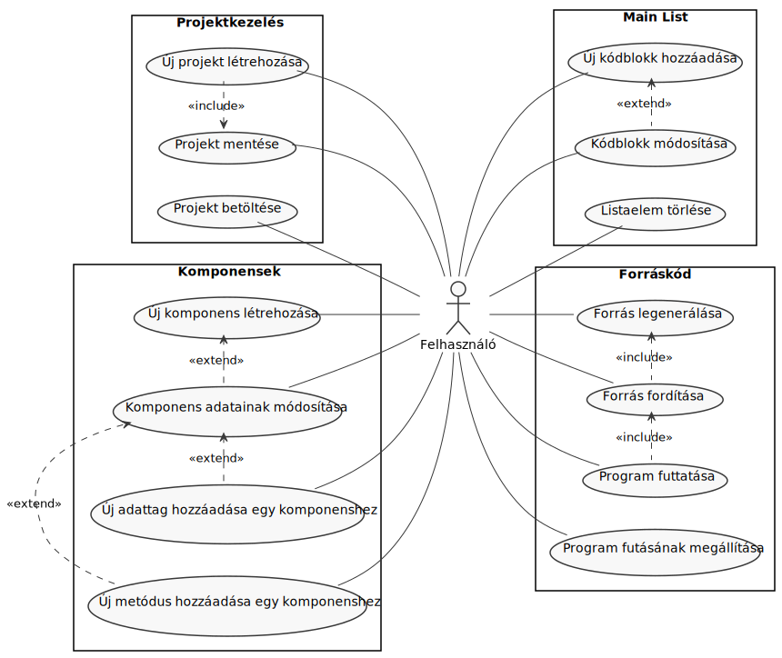

> Borító

# Témabejelentő

Egy olyan kódszerkesztő, amely támogatja az osztály-sablon könyvtár biztosította eszközök egyszerű létrehozását vizuális formában. Hozzájárul a kód újra felhasználásának gyakorlásához és az objektumorientált programok öröklődéseinek megértéséhez. Emellett fejleszti a programtervezési készségeket a programozási tételek mentén. Az átlagos kóddal szemben sokkal érthetőbb formában jeleníti meg egy program összetételét.

Az osztályok egy-egy építőelemként jelennek meg és felületet biztosítanak részegységek hozzáadására. Lehetőséget ad a könyvtár által meghatározott objektumok létrehozására, felülírandó metódusok definiálására, majd ezek építőelemként történő felhasználására. Az így összeállított saját osztályokra ezután az alkalmazás hagyományos kódszerkesztő részében lehet hivatkozni, így létrehozva a teljes programot, melyből ezután egy C++ forráskód generálódik.

Az alkalmazás Qt Creator segítségével lesz megvalósítva C++ nyelven. Azért erre esett a választás, mert minden szükséges eszközt biztosít az applikáció igényeihez és a hatékony fejlesztéshez. Ha esetleg a későbbiekben több platformon is elérhetővé szeretnénk tenni az alkalmazást, akkor ebben a környezetben ez egyszerűen megoldható és mindenhol ugyanolyan formában jelenik majd meg. 

# Tartalomjegyzék
0. [Köszönetnyilvánítás](#köszönetnyilvánítás)
1. [Bevezetés](#bevezetés)
2. [Felhasználói dokumentáció](#felhasználói-dokumentáció)
    1. [Applikáció bemutatása](#applikáció-bemutatása)
    2. [Telepítés és rendszerkövetelmények](#telepítés-és-rendszerkövetelmények)
    3. [Használat](#használat)
        1. [Kezdőlap](#kezdőlap)
			1. [Component Editor](#component-editor)
			2. [Main List Editor](#main-list-editor)
			3. [Forráskód nézegető és fordítás, futtatás](#forráskód-nézegető-és-fordítás-futtatás)
3. [Fejlesztői dokumentáció](#fejlesztői-dokumentáció)
    1. [Fejlesztői környezet](#fejlesztői-környezet)
    2. [Drótváztervek](#drótváztervek)
	3. [Használati esetek](#használati-esetek)
    4. [Architektúra](#architektúra)
    5. [Nézet](#nézet)
    6. [Modell](#modell)
		1. [Modell adattagok és metódusok](#modell-adattagok-és-metódusok)
			1. [Adattagok](#adattagok)
			2. [Projektkezelés](#projektkezelés)
			3. [Létrehozó függvények](#létrehozó-függvények)
			4. [Törlő függvények](#törlő-függvények)
			5. [Setterek](#setterek)
			6. [Getterek](#getterek)
			7. [Egyéb függvények](#egyéb-függvények)
			8. [Forráskód generálás](#forráskód-generálás)
			9. [Fordítás és futtatás](#fordítás-és-futtatás)
		3. [Modell által használt osztályok](#modell-által-használt-osztályok)
			1. [Component](#component)
			2. [SaveData](#savedata)
			3. [Egyéb segédobjektumok](#egyéb-segédobjektumok)
    7. [Perzisztencia](#perzisztencia)
	8. [Signal-ok és Slot-ok](#signal-ok-és-slot-ok)
	9. [Tesztelés](#tesztelés)
		1. [Kézi tesztek](#kézi-tesztek)
		2. [Automatikus tesztek](#automatikus-tesztek)
4. [Összefoglalás](#összefoglalás)
5. [További fejlesztési lehetőségek](#további-fejlesztési-lehetőségek)
    1. [Component Editor](#component-editor)
    2. [Fordító](#fordító)
    3. [Main Editor](#main-editor)
    4. [Hivatkozások](#hivatkozások)
    5. [Kódszerkesztő](#kódszerkesztő)
    6. [Syntax Higlighting](#syntax-higlighting)
    7. [Cross-platform](#cross-platform)
    8. [Nyelv](#nyelv)
    9. [Megjelenés](#megjelenés)
6. [Forrásjegyzék](#forrásjegyzék)

# Köszönetnyilvánítás

Ezúton szeretném megköszönni mindazoknak, akik nélkül ez a dolgozat nem jöhetett volna létre:

Köszönet a konzulensemnek, aki rendelkezésemre bocsátotta tudását, hasznos tanácsokkal és rengeteg segítséggel láttott el a dolgozat elkészítése során.

Köszönet az Eötvös Loránd Tudományegyetem Informatikai Karának, hogy az itt eltöltött félévek alatt elsajátíthattam a szükséges alapokat.

Köszönet a családomnak és barátaimnak, hogy minden támogatást megadtak, amire a tanulmányaim során szükségem volt.

# Bevezetés

> gtlib rövid leírás

Programozás során elengedhetetlen alapokat nyújt a programozási tételek használata, megfelelő alkalmazása. Ezért nem is meglepő, hogy az egyetemen is már az első félévben találkoznak ezzel a hallgatók.

E tudás elsajátításának megkönnyítése érdekében hozta létre dr. Gregorics Tibor Tanár Úr a programozási tételekhez osztálysablonokat megvalósító c++ könyvtárat, amely ezáltal hozzájárul mind a kód újra felhasználásának gyakorlásához, mind az objektumorientált programok öröklődéseinek megértéséhez, de a legfontosabb, hogy fejleszti a programtervezési készségeket a programozási tételek mentén.

A második félévben találkoztam az osztálysablon könyvtárral az Objektumelvű Programozás tárgy keretein belül. Eleinte nem volt a kedvencem, de a félév végére rájöttem, hogy mekkora jelentősége is van igazából.

Mikor eljött az idő a szakdolgozati témaválasztásnak, sokat gondolkoztam, hogy mi is legyen a téma, végül Várkonyi Teréz Anna tanárnő weboldalán futottam össze egy kiírt témával, amely felkeltette az érdeklődésemet és így jöhetett létre jelen dolgozat.

Az alap terv az volt, hogy a könyvtár használatát mégtovább egyszerűsítsük és befogadhatóbbá tegyük azok számára, akik részben még csak ismerkednek a programozással. A felület tehát előre összeállított, minden fontos elemet tartalmazó komponenseket biztosít az átláthatóság kedvéért.

## Osztály-sablon könyvtár

Az osztály-sablon könyvtár a visszavezetéssel tervezett programok C++-beli megvalósítását támogatja. Ahhoz a programozási módszerhez illeszkedik, amely programozási tételekre vezeti vissza a megoldandó feladatot, és a megoldó programkódhoz a könyvtár elemeinek újrahasznosításával jut el. Ehhez egyrészt objektum-orientált technikákra (objektum összetétel, származtatás, virtuális metódusok felüldefiniálása), másrészt osztály-sablonok példányosítására van szükség. A könyvtárban alapvetően kétféle osztályt találunk. Egyfelől a különféle programozási tételeket általánosan leíró osztály-sablonokat, másfelől a nevezetes felsorolásokat definiáló osztály-sablonokat.

Egy tipikus felhasználása a könyvtárnak a következő:
1. Egy konkrét feladat megoldásához származtatunk egy osztályt a feladat megoldására alkalmas programozási tétel osztály-sablonjából,
	1. megadva ezen osztály-sablon sablon-paramétereit (köztük a megoldáshoz felsorolandó elemek típusát: Item ),
	2. felüldefiniálva az osztály-sablon bizonyos virtuális metódusait.
2. Példányosítjuk a fenti osztályt, és ezzel létrehozunk egy tevékenység objektumot.
3. Példányosítunk egy alkalmas felsoroló objektumot. Ennek osztályát vagy közvetlenül a könyvtárból vesszük, vagy magunk implementáljuk a könyvtár Enumerator interfészét megvalósítva a first() , next() , current() , end() metódusokat. Ügyelni kell arra, hogy a felsorolt elemek típusa egyezzen meg a programozási tétel által feldolgozott elemek típusával. (Ez az Item sablon-paraméter helyébe írt típus).
4. Hozzákapcsoljuk a tevékenység objektumhoz ( addEnumerator() ) a felsoroló objektumot.
5. A tevékenység objektumnak meghívjuk a run() metódusát, majd különféle getter-ekkel lekérdezzük a tevékenység eredményét.

### Szerkezete


# Felhasználói dokumentáció

## Applikáció bemutatása

Programozás során elengedhetetlen alapokat nyújt a programozási tételek használata, megfelelő alkalmazása. E tudás elsajátításának megkönnyítése érdekében hozta létre dr. Gregorics Tibor Tanár Úr a programozási tételekhez osztálysablonokat megvalósító c++ könyvtárat, amely ezáltal hozzájárul mind a kód újra felhasználásának gyakorlásához, mind az objektumorientált programok öröklődéseinek megértéséhez, de a legfontosabb, hogy fejleszti a programtervezési készségeket a programozási tételek mentén.

Az aplikáció a könyvtár használatát mégtovább egyszerűsíti és befogadhatóbbá teszi azok számára, akik részben még csak ismerkednek a programozással. A felület tehát előre összeállított, minden fontos elemet tartalmazó komponenseket biztosít az átláthatóság kedvéért.

A felhasználónak lehetősége van kedve szerint létrehozni osztályokat a programozási tétel és enumerátor sablonokból leszármaztatva. A létrehozott osztályokat lehet ezután tovább bővíteni, részegységeiket definiálni. Az osztályok részegységei a következők lehetnek: felülírandó metódusok, saját privát adattagok, saját publikus metódusok. A programozási tételeket megvalósító osztályok esetében az általuk használt, szintén létrehozott enumerátort is szükséges megadni. Ezeken kívül lehetőség van saját struktúrák definiálására is, melyek saját publikus adattagokat és metódusokat tartalmazhatnak.

Az általunk létrehozott osztályok közül a "main függvényben felhasználandónak" jelölt programozási tételeket megvalósító osztályok megjelennek a középen található listában, amely a program futásának manipulálására hivatott. Itt meghatározni, hogy milyen sorrendben fussanak le a tételeink, emelett plusz kódrészleteket is tudunk hozzáadni, amely lehetőséget biztosít egyéb kiíratásokra, beolvasásokra, ellenőrzésekre.

A megadott adatok alapján a program generál egy c++ forráskódot, amelyet akár fel is használhatunk saját környezetben, azonban az applikációban rendelkezésre áll a forráskód lefordításának és futtatásának lehetősége. Ehhez a beállításokban szükséges bekonfigurálni a g++ fordító adatait. Az alkalmazás megjeleníti a fordítás és futtatás kimenetét is.

## Telepítés és rendszerkövetelmények

> zippelt exe + dll-ek

A LibViz tesztelése elsősorban Windows 10-en zajlott, így ez az elsődlegesen támogatott operációs rendszer.

Ha a felhasználó a forráskód alapján szeretné futtatni a programot lokális környezetben, akkor erre is van lehetőség. Az alkalmazás kódja GitHub-on elérhető a következő linken: [github repo]()
A buildelés a Qt Creator segítségével a legegyszerűbb. Ezen belül a Qt 6.0-ás verziója ajánlott, mivel ebben íródott a program.

0.  *előzetes rendszerfüggő compiler, kit beállítások*
1.	projekt betöltése a Qt Creator-be
2.	futtatás

A program már használható is.
Az ilyen módon történő telepítéssel kapcsolatban további információkat lehet találni a Qt Creator dokumentációjában.

|  Minimum rendszerkövetelmény |   |
|--------------------:|:-----------|
| Operációs rendszer: | Windows 10 |
|         Processzor: | 1 GHz      |
|            Memória: | 1 GB       |
|            Kijelző: | 800 x 600  |


## Használat

> használati lépések képekkel

### Kezdőlap

Az alkalmazás indulásakor egyből egy üres projektben találjuk magunkat, amiben kezdődhet is a munka.

#### Component Editor

#### Main List Editor

#### Forráskód nézegető és fordítás, futtatás


# Fejlesztői dokumentáció

A következőkben az alkalmazás fejlesztői szempontú felépítését mutatom be.
A fejezetben található ábrákat és diagramokat `plantuml` segítségével készítettem, kivéve ahol más forrást jelölök meg.

## Fejlesztői környezet

A LibViz egy asztali alkalmazás, melyet a Qt-val való megvalósításának köszönhetően több operációs rendszeren is lehet használni. Az implementáció Qt Creator-ben, Qt c++ segítségével történt.
A Qt Creator telepítését a Qt hivatalos oldalán elérhető leírás és letöltési lehetőség biztosította.


## Drótváztervek

A LibViz alkalmazás nézete információ megjelenítést és bekérést szolgáló dialógus ablakokból, valamint egy fő ablakból áll, amely kisebb mértékben testreszabható a megjelenített szekciók átméretezésével vagy elrejtésével. A drótvázak elkészítése a `MockFlow` nevű ingyenes webes alkalmazással lett megvalósítva.

A fő ablak három fontosabb szekcióra bontható, melyek a következők:
- A `Component Editor` a saját osztályoknak biztosított hely. Itt hozhatunk létre új elemeket, valamint módosíthatjuk a meglévőket. 
- A `Main List` a komponensek listáját tartalmazza. Itt állíthatjuk be, hogy a létrehozott komponensek milyen sorrendben fussanak a programunkban, valamint hozzáadhatunk további kódrészleteket is.
- A jobb oldalon található szövegmezők és gombok a generált forráskód böngészését, a programunk fordítását és futtatását, és iméntiek kimenetének megtekintését teszik lehetővé.

A nézet felépítése a X-as ábrán látható. Bal oldalt az általunk létrehozott osztályokat, középen a program futásának felépítését, végül jobb oldalt a létrejött program forráskódját valamint a fordítás, és futtatás eredményeit láthatjuk.


## Használati esetek

> given-when-then



## Architektúra

> csomagdiagram

Az alkalmazás háromrétegű nézet-modell-perzisztencia architektúrával lett megvalósítva.


## Nézet

> részletes uml-ek külön-külön az osztályokról

A következő ábrán látható a nézetet alkotó osztályok kapcsolata.


## Modell

> részletes uml-ek külön-külön az osztályokra


### Modell adattagok és metódusok


#### Adattagok

```cpp
QString projectName;
QMap<int,Component*> components;
QMap<int,CodeBlock*> codeblocks;
QMap<int,Struct*> structs;
QVector<int> mainIdOrder;
int lastID;
QString compilerPath;
QStringList compilerArguments;
bool compilerPathSet;
QProcess* compileProcess;
QString compileOutput;
DataAccess dataAccess;
QSettings* settings;
```

- projectName: A projekt elérési útját tárolja.
- components: A projektben lévő komponensek címét egyedi azonosítóval párosítva tároló map.
- codeblocks: A projektben lévő kódblokkok címét egyedi azonosítóval párosítva tároló map.
- structs: A projektben lévő struktúrák címét egyedi azonosítóval párosítva tároló map.
- mainIdOrder: A projektben lévő komponensek és kódblokkok main függvénybeli sorrendjét tároló vektor.
- lastID: A legutóbb létrehozott azonosítót tároló változó.
- compilerPath: A fordító elérési útját tároló változó.
- compilerArguments: A fordító argumentumait tároló változó.
- compilerPathSet: A fordító elérési útjának beállítottságát tároló változó.
- compileProcess: A fordító futtatásához szükséges QProcess objektum.
- compileOutput: A fordító kimenetét tároló változó.
- dataAccess: A projekt adatainak elérési útját tároló objektum.
- settings: A projekt beállításait tároló objektum.


#### Projektkezelés

```cpp
bool newProject();
bool saveProject();
void openProject();
void setProject(QString file);
```

- newProject(): Új projekt létrehozására alkalmas. A projekt elérési útját a nézettől kéri be.
- saveProject(): A projekt mentésére alkalmas. Ha nincs jelenlegi projekt, akkor a nézettől kéri be a projekt elérési útját.
- openProject(): Egy projekt megnyitására alkalmas. A nézettől kéri be a megnyitandó projekt elérési útját.
- setProject(QString file): A jelenlegi projekt elérési útjának beállítására alkalmas.

#### Létrehozó függvények

```cpp
int createComponent(QString name, ComponentType type);
int createCodeBlock();
int createStruct(QString name);
int createMember(int componentID);
int createCustomMethod(int componentID);
```

- createComponent(QString name, ComponentType type): Egy komponens létrehozására alkalmas megadott név és típus alapján. 
- createCodeBlock(): Egy kódblokk létrehozására alkalmas.
- createStruct(QString name): Egy struktúra megadott névvel való létrehozására alkalmas.
- createMember(int componentID): Egy komponensben egy adattag létrehozására alkalmas. A tartalmazó komponenst a megadott azonosító határozza meg.
- createCustomMethod(int componentID): Egy komponensben egy metódus létrehozására alkalmas. A tartalmazó komponenst a megadott azonosító határozza meg.

#### Törlő függvények

```cpp
void deleteComponent(int componentID);
void deleteCodeBlock(int codeBlockID);
void deleteStruct(int structID);
void deleteMember(int componentID, int memberID);
void deleteCustomMethod(int componentID, int customMethodID);
```

- deleteComponent(int componentID): Egy komponens törlése azonosító alapján.
- deleteCodeBlock(int codeBlockID): Egy kódblokk törlése azonosító alapján.
- deleteStruct(int structID): Egy struktúra törlése azonosító alapján.
- deleteMember(int componentID, int memberID): Egy adattag törlése a tároló komponens és az adattag azonosítója alapján.
- deleteCustomMethod(int componentID, int customMethodID): Egy metódus törlése a tároló komponens és az metódus azonosítója alapján.

#### Setterek

```cpp
void modifyMember(int componentID, int memberID, QString type, QString name);
void modifyCustomMethod(int componentID, int customMethodID, QString header, QString body);
void setObjectName(int componentID, QString objectName);
void setItem(int componentID, QString item);
void setValue(int componentID, QString value);
void setOptimist(int componentID, bool optimist);
void setCompare(int componentID, QString compare);
void setEnumerator(int componentID, int enumeratorID);
void setMethod(int componentID, MethodType methodType, QString methodBody);
void setCode(int codeBlockID, QString code);
void setCompilerPath(QString path);
void setCompilerArguments(QString path);
void setMainIdOrder(QVector<int> ids);
```

- modifyMember(int componentID, int memberID, QString type, QString name): Egy adattag módosítására alkalmas. A tároló komponens és az adattag azonosítója alapján. A megadott típust és nevet felhasználva módosítja az adattagot.
- modifyCustomMethod(int componentID, int customMethodID, QString header, QString body): Egy metódus módosítására alkalmas. A tároló komponens és a metódus azonosítója alapján. A megadott fejlécet és a törzsét felhasználva módosítja a metódust.
- setObjectName(int componentID, QString objectName): Egy adott azonosítójú komponens objektum nevének beállítására alkalmas.
- setItem(int componentID, QString item): Egy adott azonosítójú komponens item típusának beállítására alkalmas.
- setValue(int componentID, QString value): Egy adott azonosítójú komponens value típusának beállítására alkalmas.
- setOptimist(int componentID, bool optimist): Egy adott azonosítójú komponens optimist értékének beállítására alkalmas.
- setCompare(int componentID, QString compare): Egy adott azonosítójú komponens compare értékének beállítására alkalmas.
- setEnumerator(int componentID, int enumeratorID): Egy adott azonosítójú komponens enumerator azonosítójának beállítására alkalmas.
- setMethod(int componentID, MethodType methodType, QString methodBody): Egy adott azonosítójú komponens metódusának beállítására alkalmas. A metódus típusát és a törzsét szöveget felhasználva módosítja a metódust.
- setCode(int codeBlockID, QString code): Egy adott azonosítójú kódblokk kód szövegének beállítására alkalmas.
- setCompilerPath(QString path): A fordító elérési útjának beállítására alkalmas.
- setCompilerArguments(QString path): A fordító argumentumainak beállítására alkalmas.
- setMainIdOrder(QVector<int> ids): A main függvény azonosítójának a sorrendjének beállítására alkalmas.


#### Getterek

```cpp
QString getEnumeratorNameById(int enumeratorID);
QString getCompileOutput();
QString getCompilerPath();
QStringList getCompilerArguments();
QString getProjectName();
```

- getEnumeratorNameById(int enumeratorID): Egy adott azonosítójú enumerátor nevének lekérdezésére alkalmas.
- getCompileOutput(): A fordítás kimenetének lekérdezésére alkalmas.
- getCompilerPath(): A fordító elérési útjának lekérdezésére alkalmas.
- getCompilerArguments(): A fordító argumentumainak lekérdezésére alkalmas.
- getProjectName(): A projekt nevének lekérdezésére alkalmas.


#### Egyéb függvények

```cpp
bool isComponentNameUsed(QString name);
bool isObjectNameUsed(QString objectName);
int newID() {return ++lastID;}
void loadConfig();
```

- isComponentNameUsed(QString name): Lekérdezi, hogy a megadott komponens név használatban van-e már másik komponens által.
- isObjectNameUsed(QString objectName): Lekérdezi, hogy a megadott objektum név használatban van-e másik komponens által.
- newID(): Visszaad egy új egyedi azonosítót.
- loadConfig(): Betölti az előző munkamenetben használt beállításokat.


#### Forráskód generálás

```cpp
QString generateSource();
QString generateMainSource();
QString replaceReference(QString codeString);
QString getReferenceSource(QString objectName);
```

- generateSource(): A forráskód generálására alkalmas.
- generateMainSource(): A main függvény forrásának külön generálására alkalmas. A generateSource() függvény segédfüggvényeként van jelen.
- replaceReference(QString codeString): A forráskódban a hivatkozásokat a hivatkozott objektum kódjára cserélő segédfüggvény.
- getReferenceSource(QString objectName): Egy hivatkozott objektum forráskódjának objektumnév alapján történő lekérdezésére alkalmas segédfüggvény.


#### Fordítás és futtatás

```cpp
void run();
void compile();
void stopCompile();
```

- run(): A fordított program futtatására szolgál. Amennyiben még nem volt lefordítva a jelenlegi forráskód, ezt is megteszi.
- compile(): A fordítást kezdeményező függvény. A beállításokban megadott g++ adatokat használva fordítja a jelenlegi forráskódot.
- stopCompile(): A fordítás megszakítására használható.


### Modell által használt osztályok

- __Component__: A felhasználó által létrehozott komponens, amely ábrázolhat egy programozási tételt vagy egy felsorolót. A komponens minden adata egy ilyen objektumban tárolódik.
- __CodeBlock__: A felhasználó által létrehozott kódblokk, amely a main függvényben kerül felhasználásra. A kódblokk minden adata egy ilyen objektumban tárolódik.
- __Struct__: A felhasználó által létrehozott struktúra, amely egy programozási tételben használható. A struktúra minden adata egy ilyen objektumban tárolódik.
- __Member__: Egy struktúra, amely a komponensekben szereplő adattagok tárolására hivatott.
- __CustomMethod__: Egy struktúra, amely a komponensekben szereplő saját metódusok tárolására hivatott.
- __SaveData__: Egy struktúra, amely képes minden olyan adatot képes tárolni, amely egy projekt elmentéséhez szükséges.


#### Component

adattagjai:
```cpp
QString name;
int id;
QString objectName;
ComponentType type;
QString item;
int enumeratorID;
QString enumeratorObjectName;
bool optimist;
QString value;
QString compare;
QMap<MethodType,QString> methods;
QMap<int,Member> members;
QMap<int,CustomMethod> customMethods;
```

- name: A komponens neve.
- id: A komponens azonosítója.
- objectName: A komponens objektum neve.
- type: A komponens típusa.
- item: A komponens objektumhoz tartozó item típus.
- enumeratorID: A komponens által használt felsoroló azonosítója.
- enumeratorObjectName: A komponens által használt felsoroló objektum neve.
- optimist: A komponens optimista-e.
- value: A omponens value típusát tartalmazza.
- compare: A komponens összehasonlítási módja.
- methods: A komponens felülírt metódusai.
- members: A komponens adattagjai azonosítókkal párosítva.
- customMethods: A komponens saját metódusai azonosítókkal párosítva.


A Component metódusai továbbá a nevükből egyértelmű létrehozó, törlő, setter és getter metódusok.

### SaveData

adattagjai:
```cpp
QString projectName;
QMap<int,Component*> components;
QMap<int,CodeBlock*> codeblocks;
QMap<int,Struct*> structs;
QVector<int> mainIdOrder;
int lastID;
```

- projectName: A projekt neve.
- components: A projektben lévő komponensek címeit tárolja azonosítóval párosítva.
- codeblocks: A projektben lévő kódblokkok címeit tárolja azonosítóval párosítva.
- structs: A projektben lévő struktúrák címeit tárolja azonosítóval párosítva.
- mainIdOrder: A projektben lévő komponensek és kódblokkok main függvénybeli sorrendje.
- lastID: Az utoljára létrehozott egyedi objektum azonosító.

A SaveData konstruktorában minden tárolandó adatot egyben meg lehet adni.

#### Egyéb segédobjektumok

```cpp
enum ComponentType;
enum MethodType;
static const QMap<ComponentType,QString> componentTypeNameStrings;
static const QMap<MethodType,QPair<QString,QString>> methodHeaderStrings;
static const QMap<MethodType,QString> methodTypeStrings;
static const QMap<QString,MethodType> methodTypeFromString;
static const QMap<QString,ComponentType> componentTypeFromString;
```

- ComponentType: Egy enum, amely a lehetséges komponens típusokat tárolja.
- MethodType: Egy enum, amely a lehetséges metódus típusokat tárolja.
- componentTypeNameStrings: Egy asszociatív tároló, amely segítségével komponens típus alapján visszakapjuk a típus megjeleníthető elnevezését.
- methodHeaderStrings: Egy asszociatív tároló, amely segítségével metódus típus alapján visszakapjuk a metódus fejlécét.
- methodTypeStrings: Egy asszociatív tároló, amely segítségével metódus típus alapján visszakapjuk a metódus típusának megjeleníthető elnevezését.
- methodTypeFromString: Egy asszociatív tároló, amely segítségével metódus elnevezése alapján visszakapjuk a metódus típusát.
- componentTypeFromString: Egy asszociatív tároló, amely segítségével komponens elnevezése alapján visszakapjuk a komponens típusát.


## Perzisztencia

Az alkalmazás képes kezdetleges projektkezelésre, ami a létrehozást, mentést és betöltést foglalja magában. Egy projekt egy xml fájlban tárolódik, aminek az elérési útját a felhasználó határozza meg. 

A projektfájl a következő struktúrával rendelkezik:

```xml
<?xml version="1.0" encoding="UTF-8"?>
<project>
	<name>ProjectName</name>
	<data>
		<components>
			<component>
				<id>ComponentID</id>
			
				<!-- QString name; -->
				<name>ComponentName</name>
				
				<!-- QString objectName; -->
				<objectname>ComponentObjectName</objectname>
				
				<!-- ComponentType type; -->
				<type>ComponentType</type>
				
				<!-- QString item; -->
				<item>ComponentItem</item>
				
				<!-- int enumeratorID; -->
				<enumeratorID>ComponentEnumeratorID</enumeratorID>
				
				<!-- QString enumeratorObjectName; -->
				<enumeratorObjectName>ComponentEnumeratorObjectName</enumeratorObjectName>
				
				<!-- bool optimist; -->
				<optimist>ComponentOptimist</optimist>
				
				<!-- QString value; -->
				<value>ComponentValue</value>
				
				<!-- QString compare; -->
				<compare>ComponentCompare</compare>
				
				<!-- QMap<MethodType,QString> methods; -->
				<methods>
					<method>
						<header>MethodHeader</header>
						<body>MethodBody</body>
					</method>
					<!-- ... -->
				</methods>
				
				<!-- QMap<int,Member> members; -->
				<members>
					<member>
						<id>MemberID</id>
						<type>MemberType</type>
						<name>MemberName</name>
					</member>
					<!-- ... -->
				</members>
				
				<!-- QMap<int,CustomMethod> customMethods; -->
				<custommethods>
					<custommethod>
						<id>CustomMethodID</id>
						<header>CustomMethodHeader</header>
						<body>CustomMethodBody</body>
					</custommethod>
					<!-- ... -->
				</custommethods>
			</component>
			<!-- ... -->
		</components>
		<structs>
			<struct>
				<id>StructID</id>
				<name>StructName</name>
				<!-- QMap<int,Member> members; -->
				<members>
					<member>
						<id>MemberID</id>
						<type>MemberType</type>
						<name>MemberName</name>
					</member>
					<!-- ... -->
				</members>
				
				<!-- QMap<int,CustomMethod> customMethods; -->
				<custommethods>
					<custommethod>
						<id>CustomMethodID</id>
						<header>CustomMethodHeader</header>
						<body>CustomMethodBody</body>
					</custommethod>
					<!-- ... -->
				</custommethods>
			</struct>
			<!-- ... -->
		</structs>
		<codeblocks>
			<codeblock>
				<id>CodeBlockID</id>
				<code>CodeBlockCode</code>
			</codeblock>
			<!-- ... -->
		</codeblocks>
	</data>
</project>
```

Ebben a formátumban a projektnek két fő eleme van:
- A `<name>` tag a projekt nevét tartalmazza.
- A `<data>` tag tartalmazza a komponenseket, struktúrákat és kódblokkokat.

A `<data>` tag-en belül a `<components>` tag a komponenseket tartalmazza. A komponensek egy-egy `<component>` tag párban vannak és tartalmuk a következő:
- Az `<id>` tag a komponens azonosítóját tartalmazza.
- A `<name>` tag a komponens nevét tartalmazza.
- Az `<objectname>` tag a komponens objektum nevét tartalmazza.
- A `<type>` tag a komponens típusát tartalmazza.
- Az `<item>` tag a komponens által használt `item`-ek típusát tartalmazza.
- Az `<enumeratorID>` tag a komponens által használt felsoroló azonosítóját tartalmazza.
- Az `<enumeratorObjectName>` tag a komponens által használt felsoroló objektum nevét tartalmazza.
- Az `<optimist>` tag azt tartalmazza, hogy az adott komponens optimista módban működik-e.
- A `<value>` tag a komponens `value` típusát tartalmazza.
- A `<compare>` tag a komponens összehasonlítási módját tartalmazza.
- A `<methods>` tag a komponens felülírt metódusait tartalmazza. A metódusok egy-egy `<method>` tag párba vannak és tartalmuk a következő:
    - Az `<header>` tag a metódus fejlécét tartalmazza.
    - A `<body>` tag a metódus törzsét tartalmazza.
- A `<members>` tag a komponens adattagjait tartalmazza. A tagok egy-egy `<member>` tag párba vannak és tartalmuk a következő:
    - Az `<id>` tag az adattag azonosítóját tartalmazza.
    - A `<type>` tag az adattag típusát tartalmazza.
    - A `<name>` tag az adattag nevét tartalmazza.
- A `<custommethods>` tag a komponens egyedi metódusait tartalmazza. A metódusok egy-egy `<custommethod>` tag párba vannak és tartalmuk a következő:
    - Az `<id>` tag a metódus azonosítóját tartalmazza.
    - A `<header>` tag a metódus fejlécét tartalmazza.
    - A `<body>` tag a metódus törzsét tartalmazza.

A `<data>` tag-en belül a `<structs>` tag a struktúrákat tartalmazza. A struktúrák egy-egy `<struct>` tag párban vannak és tartalmuk a következő:
- Az `<id>` tag a struktúra azonosítóját tartalmazza.
- A `<name>` tag a struktúra nevét tartalmazza.
- Az `<members>` tag a struktúra adattagjait tartalmazza. A tagok egy-egy `<member>` tag párba vannak és tartalmuk a következő:
    - Az `<id>` tag az adattag azonosítóját tartalmazza.
    - A `<type>` tag az adattag típusát tartalmazza.
    - A `<name>` tag az adattag nevét tartalmazza.
- A `<custommethods>` tag a struktúra egyedi metódusait tartalmazza. A metódusok egy-egy `<custommethod>` tag párba vannak és tartalmuk a következő:
    - Az `<id>` tag a metódus azonosítóját tartalmazza.
    - A `<header>` tag a metódus fejlécét tartalmazza.
    - A `<body>` tag a metódus törzsét tartalmazza.

A `<data>` tag-en belül a `<codeblocks>` tag a kódblokkokat tartalmazza. A kódblokkok egy-egy `<codeblock>` tag párban vannak és tartalmuk a következő:
- Az `<id>` tag a kódblokk azonosítóját tartalmazza.
- A `<code>` tag a kódblokk kódját tartalmazza.

> dataaccess uml


## Signal-ok és Slot-ok

| küldő | signal | fogadó | slot |
|-------|--------|--------|------|
| modell | compilerPathNotSet() | nézet:MainWindow | showCompilerPathWarning() |
| modell | haveCompileOutput(QString) | nézet:MainWindow | showCompileOutput(QString) |
| modell | compileProcessEnded() | nézet:MainWindow | allowCompile() |
| modell | needProjectNameForSave() | nézet:MainWindow | showProjectSaveDialog() |
| modell | needProjectNameForOpen() | nézet:MainWindow | showProjectOpenDialog() |
| modell | projectLoaded(SaveData) | nézet:MainWindow | refresh(SaveData) |
| modell | cleared() | nézet:MainWindow | clear() |


## Tesztelés

### Kézi tesztek
### Automatikus tesztek

# Összefoglalás

A programozási tételek ismerete és alkalmazása tehát pozitív hatással lehet kód minőségére, ezért hasznos ennek a gyakorlása. 

...

Remélem valamilyen formában a jövőben segítséget nyújthat a szakdolgozatban foglalt alkalmazás a programozni tanuló hallgatók számára.

# További fejlesztési lehetőségek

## Component Editor

A komponensek szerkesztésének megkönnyítése érdekében előre definiált, választható adattag típusokat is be lehetne építeni a szerkesztőbe. Valamint olyan további lehetőségeket, mint az adattagok és metódusok elérhetőségének beállítása.

## Fordító

Az alkalmazás jelenleg csak a g++ használatát támogatja. Ezt is csak korlátozottan. Egy beépített alapértelmezett fordító jelenthetne egy fejlesztési módot. Emellett más fordítóprogramok támogatása is hasznos lehet.

## Main Editor

A program felépítését elősegítő egyéb funkciók lehetnének a következők:
- Hozzáadható `if-else` és `try-catch` blokkok.
- Előre definiált parancssoros adatbekérés.
- Előre definiált kiíratások.

## Hivatkozások

A felhasználó által létrehozott osztályokra jelenleg a `%object%` formátumban lehet hivatkozni. Ez egyéb drag-and-drop és hasonló funkciók implementálásával továbbfejleszthető.

## Kódszerkesztő

A gyakorlottabb felhasználók számára előnyös lehet a generált kód további szerkesztése az alkalmazáson belül. Ez azonban nagyban bonyolítaná a háttérfolyamatokat, ha azt szeretnénk, hogy az itt írt kódból visszafele is generálódjanak építőelemek.

## Syntax Higlighting

Az applikációban írt és generált c++ kód megjelenítése jelenleg nem tartalmaz semmilyen szintaxis kiemelő formázást, amely nagy segítségét jelnthetne a kód értelmezésében, főleg kezdő programozók számára.

## Cross-platform

Az alkalmazás Windows-on lett lefejlesztve és tesztelve, azonban a Qt által támogatott egyéb platformokon is lehetőség van a használatára. A zavartalan használat érdekében további fejlesztésekre és tesztelésekre is szükség lehet támogatni kívánt platformoktól függően.

## Nyelv

Az alkalmazás jelenleg csak angol nyelvű felhasználói felülettel rendelkezik, ezért egyéb nyelvek támogatása is előnyös lehet.

## Megjelenés

A jelenlegi megjelenés a használt platfrom által biztosított alapértelmezett grafikus elemeket használja. Egyedi grafikus elemek tervezése fejleszthetné az applikáció átláthatóságát, esetleg képességeit is.

# Forrásjegyzék